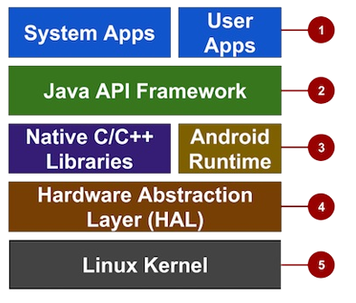

>Question Bank for MAD - First Internals
# 1.Android Development Architecture

Android provides a rich development architecture. You don’t need to know much about the components of this architecture,
but it is useful to know what is available in the system for your app to use. The following diagram shows the major components of the Android stack — the operating system and development architecture.

  

1. Apps: Your apps live at this level, along with core system apps for email, SMS messaging, calendars, Internet browsing, or contacts.
2. Java API Framework: All features of Android are available to developers through application programming interfaces (APIs) written in the Java language. You don't need to know the details of all of the APIs to learn how to develop
Android	apps,	but	you	can	learn	more	about	the	following	APIs,	which	are	useful	for	creating	apps:
* View	System	used	to	build	an	app's	UI,	including	lists,	buttons,	and	menus.
* Resource	Manager	used	to	access	to	non-code	resources	such	as	localized	strings,	graphics,	and	layout	files.
* Notification	Manager	used	to	display	custom	alerts	in	the	status	bar.
* Activity	Manager	that	manages	the	lifecycle	of	apps.
* Content	Providers	that	enable	apps	to	access	data	from	other	apps.
* All	framework	APIs	that	Android	system	apps	use.
3.	Libraries	and	Android	Runtime:	Each	app	runs	in	its	own	process	and	with	its	own	instance	of	the	Android	Runtime,
which	enables	multiple	virtual	machines	on	low-memory	devices.	Android	also	includes	a	set	of	core	runtime	libraries
that	provide	most	of	the	functionality	of	the	Java	programming	language,	including	some	Java	8	language	features	that
the	Java	API	framework	uses.	Many	core	Android	system	components	and	services	are	built	from	native	code	that
require	native	libraries	written	in	C	and	C++.	These	native	libraries	are	available	to	apps	through	the	Java	API
framework.
4.	Hardware	Abstraction	Layer	(HAL):	This	layer	provides	standard	interfaces	that	expose	device	hardware	capabilities
to	the	higher-level	Java	API	framework.	The	HAL	consists	of	multiple	library	modules,	each	of	which	implements	an
interface	for	a	specific	type	of	hardware	component,	such	as	the	camera	or	bluetooth	module.
5.	Linux	Kernel:	The	foundation	of	the	Android	platform	is	the	Linux	kernel.	The	above	layers	rely	on	the	Linux	kernel	for
underlying	functionalities	such	as	threading	and	low-level	memory	management.	Using	a	Linux	kernel	enables	Android
to	take	advantage	of	key	security	features	and	allows	device	manufacturers	to	develop	hardware	drivers	for	a	well
known	kernel.

# 2.Challenges of Android App Development

 While	the	Android	platform	provide	rich	functionality	for	app	development,	there	are	still	a	number	of	challenges	you	need
 to	address,	such	as:
 * Building	for	a	multi-screen	world
 * Getting	performance	right
 * Keeping	your	code	and	your	users	secure
 * Remaining	compatible	with	older	platform	versions
 * Understanding	the	market	and	the	user.
 ### Building	for	a	multi-screen	world
 Android	runs	on	billions	of	handheld	devices	around	the	world,	and	supports	various	form	factors	including	wearable
 devices	and	televisions.	Devices	can	come	in	different	sizes	and	shapes	that	affect	the	screen	designs	for	UI	elements	in
 your	apps.	
In	addition,	device	manufacturers	may	add	their	own	UI	elements,	styles,	and	colors	to	differentiate	their	products.	Each
 manufacturer	offers	different	features	with	respect	to	keyboard	forms,	screen	size,	or	camera	buttons.	An	app	running	on
 one	device	may	look	a	bit	different	on	another.	The	challenge	for	many	developers	is	to	design	UI	elements	that	can	work
 on	all	devices	It	is	also	the	developer’s	responsibility	to	provide	an	app’s	resources	such	as	icons,	logos,	other	graphics,
 and	text	styles	to	maintain	uniformity	of	appearance	across	different	devices.
 ### Maximizing	app	performance
 An	app's	performance—how	fast	it	runs,	how	easily	it	connects	to	the	network,	and	how	well	it	manages	battery	and
 memory	usage—is	affected	by	factors	such	as	battery	life,	multimedia	content,	and	Internet	access.	You	must	be	aware	of
 these	limitations	and	write	code	in	such	a	way	that	the	resource	utilization	is	balanced	and	distributed	optimally.	For
 example,	you	will	have	to	balance	the	background	services	by	enabling	them	only	when	necessary;	this	will	save	battery
 life	of	the	user’s	device.
 ### Keeping	your	code	and	your	users	secure
 You	need	to	take	precautions	to	secure	your	code	and	the	user’s	experience	when	using	your	app.	Use	tools	such	as
 ProGuard	(provided	in	Android	Studio),	which	detects	and	removes	unused	classes,	fields,	methods,	and	attributes,	and
 encrypt	all	of	your	app's	code	and	resources	while	packaging	the	app.	To	protect	your	user's	critical	information	such	as
 logins	and	passwords,	you	must	secure	the	communication	channel	to	protect	data	in	transit	(across	the	Internet)	as	well	as
 data	at	rest	(on	the	device).
 ### Remaining	compatible	with	older	platform	versions
 Consider	how	to	add	new	Android	platform	version	features	to	an	app,	while	ensuring	that	the	app	can	still	run	on	devices
 with	older	platform	versions.	It	is	impractical	to	focus	only	on	the	most	recent	Android	version,	as	not	all	users	may	have
 upgraded	or	may	be	able	to	upgrade	their	devices

# 3.Building projects using android studio
Ans:
-Project Creation
-Palette
-Component Tree
-Code and Design Section
-Attribute Section

3. Building Projects Using Android Studio
Android Studio is the official IDE for Android app development, providing an organized and streamlined environment. Below are the key components when building projects, along with relevant examples.

a) Project Creation: In Android Studio, the project creation wizard helps set up the project by specifying details like the app name (e.g., "MyFirstApp"), package name (e.g., com.example.myfirstapp), and activity template (e.g., "Empty Activity"). The IDE automatically generates the necessary files and folders, including the manifest, Java files, and resource folders.

Example: If you're creating a "ToDoApp", you might choose Kotlin as the language and an Empty Activity as the template.
b) Palette: The Palette contains various UI components (e.g., TextView, Button, ImageView) that you can drag and drop into the layout. It simplifies the design process by generating XML code automatically.

Example: Dragging a Button from the Palette to the layout editor adds the following XML:
xml
Copy code
<Button android:text="Click Me" ... />
c) Component Tree: The Component Tree provides a hierarchical view of the UI elements. It shows how different components are nested within layout structures. For instance, if a Button is added inside a LinearLayout, it will appear as a child of the layout in the tree.

Example:
css
Copy code
LinearLayout
    └── Button
d) Code and Design Section: Android Studio offers two sections for layout design: the Code view (XML) and the Design view (visual editor). The Code view allows developers to edit XML directly, while the Design view provides a WYSIWYG interface for dragging and arranging components.

Example: In Code view, you might manually modify the text of a Button:
xml
Copy code
<Button android:text="Submit" ... />
e) Attribute Section: The Attribute Section allows you to modify the properties (e.g., text size, color, margins) of selected components. For example, selecting a TextView in the Design view opens the attributes panel where you can adjust its properties.

Example: Setting the text size in the Attribute Section results in XML like this:
xml
Copy code
<TextView android:textSize="20sp" />

# 4.Exploring project - android studio
Ans: 
-manifest
-java
-resource

4. Exploring a Project in Android Studio
After creating a project, understanding its structure is essential for effective development. Android Studio organizes projects into specific folders and files, each serving a particular role.

a) Manifest: The AndroidManifest.xml file is vital for the Android system to understand your app. It declares activities, services, permissions, and other application configurations. For example, you specify the app's required permissions here.

Example: To request internet access, you add:
xml
Copy code
> *< uses-permission android:name="android.permission.INTERNET" />*

b) Java: The java/ directory contains the source code. This includes activity classes that manage the app's user interface and logic. The MainActivity.java file typically contains the app's main screen.

Example: In MainActivity.java, you might add a button click event:
java
Copy code
Button button = findViewById(R.id.button);
button.setOnClickListener(v -> {
    Toast.makeText(this, "Button Clicked", Toast.LENGTH_SHORT).show();
});
c) Resources (res): The res/ directory holds all non-code resources, such as layouts, strings, images, and menus.

layout/: Contains XML files that define the UI layout.
Example: activity_main.xml might define a simple layout with a TextView:
xml
Copy code
<LinearLayout>
    <TextView android:text="Hello, World!" />
</LinearLayout>
values/: Stores reusable constants like strings, colors, and dimensions.
Example: A string resource for the app name:
xml
Copy code
<string name="app_name">MyFirstApp</string>
drawable/: Contains images or vector assets used in the app.
menu/: Stores XML files that define menu structures.
This structured approach helps developers separate code from resources, making apps easier to maintain and scale.

# 5.Creating virtual device

* With	virtual	device	emulators,	you	can	test	an	app	on	different	devices	such	as	tablets	or	smartphones	—	with	different	API
* levels	for	different	Android	versions	—	to	make	sure	it	looks	good	and	works	for	most	users.	Although	it's	a	good	idea,	you
 don't	have	to	depend	on	having	a	physical	device	available	for	app	development.
* The	Android	Virtual	Device	(AVD)	manager	creates	a	virtual	device	or	emulator	that	simulates	the	configuration	for	a  particular	type	of	Android	device.	Use	the	AVD	Manager	to	define	the	hardware	characteristics	of	a	device	and	its	API	level,  and	to	save	it	as	a	virtual	device	configuration.	
* When	you	start	the	Android	emulator,	it	reads	a	specified	configuration	and  creates	an	emulated	device	on	your	computer	that	behaves	exactly	like	a	physical	version	of	that	device.
### Creating	a	virtual	device
* To	run	an	emulator	on	your	computer,	use	the	AVD	Manager	to	create	a	configuration	that	describes	the	virtual	device.
* Select	Tools	>	Android	>	AVD	Manager,	or	click	the	AVD	Manager	icon in	the	toolbar.
* The	"Your	Virtual	Devices"	screen	appears	showing	all	of	the	virtual	devices	created	previously.	Click	the	+Create	Virtual  Device	button	to	create	a	new	virtual	device.	
* You	can	select	a	device	from	a	list	of	predefined	hardware	devices.	For	each	device,	the	table	shows	its	diagonal	display  size	(Size),	screen	resolution	in	pixels	(Resolution),	and	pixel	density	(Density).	For	example,	the	pixel	density	of	the	Nexus  5	device	is		xxhdpi	,	which	means	the	app	uses	the	icons	in	the	xxhdpi	folder	of	the	mipmap	folder.	Likewise,	the	app	will  use	layouts	and	drawables	from	folders	defined	for	that	density	as	well.	
*You	also	choose	the	version	of	the	Android	system	for	the	device.	The	Recommended	tab	shows	the	recommended  systems	for	the	device.	More	versions	are	available	under	the	x86	Images	and	Other	Images	tabs
 
# 6.Running the app on a physical device

### Running	the	app	on	a	physical	device
* Always	test	your	apps	on	physical	device,	because	users	will	use	the	app	on	physical	devices.	While	emulators	are	quite  good,	they	can't	show	all	possible	device	states,	such	as	what	happens	if	an	incoming	call	occurs	while	the	app	is	running.
* To	run	the	app	on	a	physical	device,	you	need	the	following:
1. An	Android	device	such	as	a	smartphone	or	tablet.
2. A	data	cable	to	connect	the	Android	device	to	your	computer	via	the	USB	port.
3. If	you	are	using	Linux	or	Windows,	it	may	be	necessary	to	perform	additional	steps	to	run	the	app	on	a	hardware device.	
4. Check	the	Using	Hardware	Devices	documentation.	On	Windows,	you	may	need	to	install	the	appropriate	USB  driver	for	the	device.	See	OEM	USB	Drivers.
5. To	let	Android	Studio	communicate	with	a	device,	turn	on	USB	Debugging	on	the	Android	device.	On	Android	version	4.2  and	newer,	the	Developer	options	screen	is	hidden	by	default.	
>Follow	these	steps	to	turn	on	USB	Debugging:
 1.	On	the	physical	device,	open	Settings	and	choose	About	phone	at	the	bottom	of	the	Settings	screen.
 >Create	Your	First	Android	App
 2.	Tap	the	Build	number	information	seven	times.  You	read	that	correctly:	Tap	it	seven	times.
 3.	Return	to	the	previous	screen	(Settings).	Developer	options	now	appears	at	the	bottom	of	the	screen.	Tap
 Developer	options.
 4.	Choose	USB	Debugging.  Now,	connect	the	device	and	run	the	app	from	Android	Studio.

# 7.Types of Layout

 Some	view	groups	are	designated	as	layouts	because	they	organize	child	views	in	a	specific	way	and	are	typically	used	as
 the	root	view	group.	Some	examples	of	layouts	are:
* LinearLayout:	A	group	of	child	views	positioned	and	aligned	horizontally	or	vertically.
* RelativeLayout:	A	group	of	child	views	in	which	each	view	is	positioned	and	aligned	relative	to	other	views	within	the  view	group.	In	other	words,	the	positions	of	the	child	views	can	be	described	in	relation	to	each	other	or	to	the	parent  view	group.
* ConstraintLayout:	A	group	of	child	views	using	anchor	points,	edges,	and	guidelines	to	control	how	views	are  positioned	relative	to	other	elements	in	the	layout.	ConstraintLayout	was	designed	to	make	it	easy	to	drag	and	drop  views	in	the	layout	editor.
* TableLayout:	A	group	of	child	views	arranged	into	rows	and	columns.
* AbsoluteLayout:	A	group	that	lets	you	specify	exact	locations	(x/y	coordinates)	of	its	child	views.	Absolute	layouts	are  less	flexible	and	harder	to	maintain	than	other	types	of	layouts	without	absolute	positioning.
* FrameLayout:	A	group	of	child	views	in	a	stack.	FrameLayout	is	designed	to	block	out	an	area	on	the	screen	to	display  one	view.	Child	views	are	drawn	in	a	stack,	with	the	most	recently	added	child	on	top.	The	size	of	the	FrameLayout	is  the	size	of	its	largest	child	view.
* GridLayout:	A	group	that	places	its	child	screens	in	a	rectangular	grid	that	can	be	scrolled.	

# 8.Explain XML attributes

 XML	attributes	(view	properties)
 Views	have	properties	that	define	where	a	view	appears	on	the	screen,	its	size,	how	the	view	relates	to	other	views,	and  how	it	responds	to	user	input.	When	defining	views	in	XML,	the	properties	are	referred	to	as	attributes.
> For	example,	in	the	following	XML	description	of	a	TextView,	the		android:id	,		android:layout_width	, 	android:layout_height	,		android:background	,	are	XML	attributes	that	are	translated	automatically	into	the	TextView's properties:
* _<TextView_ 
 
							android:id="@+id/show_count"  
							android:layout_width="match_parent" 
							android:layout_height="wrap_content" 
							android:background="@color/myBackgroundColor" 
							android:textStyle="bold" 
							android:text="@string/count_initial_value" 
 _/>_

* Attributes	generally	take	this	form: android:attribute_name="value"
* The	attribute_name	is	the	name	of	the	attribute.	The	value	is	a	string	with	the	value	for	the	attribute.	For	example: android:textStyle="bold"
* If	the	value	is	a	resource,	such	as	a	color,	the		@		symbol	specifies	what	kind	of	resource.	For	example:  android:background="@color/myBackgroundColor"  myBackgroundColor	,	which	is	declared	to	be	The	background	attribute	is	set	to	the	color	resource	identified	as	
* Color	resources	are	described	in	"Style-related	attributes"	in	this	chapter.
* Every	view	and	view	group	supports	its	own	variety	of	XML	attributes.	Some	attributes	are	specific	to	a	view	(for	example,  TextView	supports	the	#FFF043	.  textSize		attribute),	but	these	attributes	are	also	inherited	by	any	views	that	may	extend	the  TextView	class.	Some	are	common	to	all	views,	because	they	are	inherited	from	the	root	View	class	(like	the	android:id attribute).	
* For	descriptions	of	specific	attributes,	see	the	overview	section	of	the	View	class	documentation.
### Identifying	a	view 
* To	uniquely	identify	a	view	and	reference	it	from	your	code,	you	must	give	it	an	id.	
1. The android:id		attribute	lets	you  specify	a	unique	id		—	a	resource	identifier	for	a	view. For	example:  android:id="@+id/button_count"
2. The	"@+id/button_count"		part	of	the	above	attribute	creates	a	new	(	+	)	symbol	to	indicate	that	you	are	creating	a	new	Referencing	a	view id	. To	refer	to	an	existing	resource	identifier,	omit	the	plus	( attribute,	such	as	id		called	button_count		for	the	view.	You	use	the	plus +	)	symbol.	For	example,	to	refer	to	a	view	by	its	id		in	another  android:layout_toLeftOf		(described	in	the	next	section)	to	control	the	position	of	a	view,	you	would	use:  android:layout_toLeftOf="@id/show_count"
> In	the	above	attribute, "@id/show_count"		refers	to	the	view	with	the	resource	identifier	the	view	to	be	"to	the	left	of"	the	show_count		view. Positioning	views show_count.	

* The	attribute	positions
 Some	layout-related	positioning	attributes	are	required	for	a	view,	and	automatically	appear	when	you	add	the	view	to	the
 XML	layout,	ready	for	you	to	add	values.
* LinearLayout	positioning
 For	example,	LinearLayout	is	required	to	have	these	attributes	set:
 android:layout_width
 android:layout_height
 android:orientation
 The	
android:layout_width and	 android:layout_height		attributes	can	take	one	of	three	values:
1. match_parent		expands	the	view	to	fill	its	parent	by	width	or	height.	When	the	LinearLayout	is	the	root	view,	it	expands  to	the	size	of	the	device	screen.	For	a	view	within	a	root	view	group,	it	expands	to	the	size	of	the	parent	view	group.
2. wrap_content		shrinks	the	view	dimensions	just	big	enough	to	enclose	its	content.	(If	there	is	no	content,	the	view becomes	invisible.)  Use	a	fixed	number	of	dp		(device-independent	pixels)	to	specify	a	fixed	size,	adjusted	for	the	screen	size	of	the device.	For	example,	16dp		means	16	device-independent	pixels.	Device-independent	pixels	and	other	dimensions	are described	in	"Dimensions"	in	this	chapter.
* The android:orientation		can	be:
1. horizontal:		Views	are	arranged	from	left	to	right.
2. vertical:		Views	are	arranged	from	top	to	bottom.
* Other	layout-related	attributes	include:
1. Android:layout_gravity	:	This	attribute	is	used	with	a	view	to	control	where	the	view	is	arranged	within	its	parent	view  group.	For	example,	the	following	attribute	centers	the	view	horizontally	on	the	screen:  android:layout_gravity="center_horizontal"
2. Padding	is	the	space,	measured	in	device-independent	pixels,	between	the	edges	of	the	view	and	the	view's	content,
 as	shown	in	the	figure	below.	
In	the	figure	above:
 1.	Padding	is	the	space	between	the	edges	of	the	view	(dashed	lines)	and	the	view's	content	(solid	line).	Padding	is	not
 the	same	as	margin,	which	is	the	space	from	the	edge	of	the	view	to	its	parent.
 A	view's	size	includes	its	padding.	The	following	are	commonly	used	padding	attributes:
 Android:padding	:	Sets	the	padding	of	all	four	edges.
 android:paddingTop	:	Sets	the	padding	of	the	top	edge.
 android:paddingBottom	:	Sets	the	padding	of	the	bottom	edge.
 android:paddingLeft	:	Sets	the	padding	of	the	left	edge.
 android:paddingRight	:	Sets	the	padding	of	the	right	edge.
 android:paddingStart	:	Sets	the	padding	of	the	start	of	the	view;	used	in	place	of	the	above,	especially	with	views	that are	long	and	narrow.
 android:paddingEnd	:	Sets	the	padding,	in	pixels,	of	the	end	edge;	used	along	with	android:paddingStart	.
 Tip:	To	see	all	of	the	XML	attributes	for	a	LinearLayout,	see	the	Summary	section	of	the	LinearLayout	reference	in	the
 Developer	Guide.	Other	root	layouts,	such	as	RelativeLayout	and	AbsoluteLayout,	list	their	XML	attributes	in	the	Summary  sections.
### RelativeLayout	Positioning
 Another	useful	view	group	for	layout	is	RelativeLayout,	which	you	can	use	to	position	child	views	relative	to	each	other	or	to  the	parent.	The	attributes	you	can	use	with	RelativeLayout	include	the	following:
1. android:layout_toLeftOf:	Positions	the	right	edge	of	this	view	to	the	left	of	another	view	(identified	by	its	
ID	).
2. android:layout_toRightOf:	Positions	the	left	edge	of	this	view	to	the	right	of	another	view	(identified	by	its	
ID	).
3. android:layout_centerHorizontal:	Centers	this	view	horizontally	within	its	parent.
4. android:layout_centerVertical:	Centers	this	view	vertically	within	its	parent.
5. android:layout_alignParentTop:	Positions	the	top	edge	of	this	view	to	match	the	top	edge	of	the	parent.
6. android:layout_alignParentBottom:	Positions	the	bottom	edge	of	this	view	to	match	the	bottom	edge	of	the	parent.
 For	a	complete	list	of	attributes	for	views	in	a	RelativeLayout,	see	RelativeLayout.LayoutParams.
### Style-related	attributes
 You	specify	style	attributes	to	customize	the	view's	appearance.	Views	that	don't	have	style	attributes,	such	as
1. android:textColor	,	
2. android:textSize	,	and	
3. android:background	,	take	on	the	styles	defined	in	the	app's	theme.
> The	following	are	style-related	attributes	used	in	the	XML	layout	example	in	the	previous	section:
* Android:background	:	Specifies	a	color	or	drawable	resource	to	use	as	the	background.
* android:text	:	Specifies	text	to	display	in	the	view.
* android:textColor	:	Specifies	the	text	color.
* android:textSize	:	Specifies	the	text	size.
* android:textStyle	:	Specifies	the	text	style,	such	as	 bold	

# 9.The onClick attribute

### The	onClick	attribute
 Android	Studio	provides	a	shortcut	for	setting	up	a	clickable	view,	and	for	associating	an	event	handler	with	the	view:	use  the	android:onClick		attribute	with	the	clickable	view's	element	in	the	XML	layout.
 For	example,	the	following	XML	expression	in	the	layout	file	for	a	Button	sets	android:onClick="showToast"  showToast()		as	the	event	handler:
 When	the	button	is	tapped,	its android:onClick		attribute	calls	the	Write	the	event	handler,	such	as	showToast()		method.
 showToast()		referenced	in	the	XML	code	above,	to	call	other	methods	that	implement	the app's	model	logic:
    
 public	void	showToast(View	view)	{
 //	Do	something	in	response	to	the	button	click.
 }
 In	order	to	work	with	the	android:onClick		attribute,	the	showToast()		method	must	be	public	,	return	void	,	and	require	a view		parameter	in	order	to	know	which	view	called	the	method.
 Android	Studio	provides	a	shortcut	for	creating	an	event	handler	stub	(a	placeholder	for	the	method	that	you	can	fill	in	later)  in	the	Java	code	for	the	activity	associated	with	the	XML	layout.	Follow	these	steps:
 1.	Inside	the	XML	layout	file	(such	as	activity_main.xml),	click	the	method	name	in	the	
android:onClick		attribute
 statement.
 2.	Press	Alt-Enter	in	Windows	or	Option-Return	in	Mac	OS	X,	and	select	Create	onClick	event	handler.
 3.	Choose	the	activity	associated	with	the	layout	file	(such	as	MainActivity)	and	click	OK.	This	creates	a	placeholder method	stub	in	MainActivity.java.

# 10.Design a XML Page for the given Application.