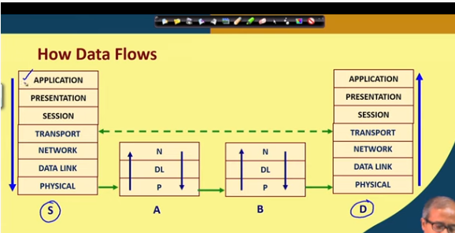
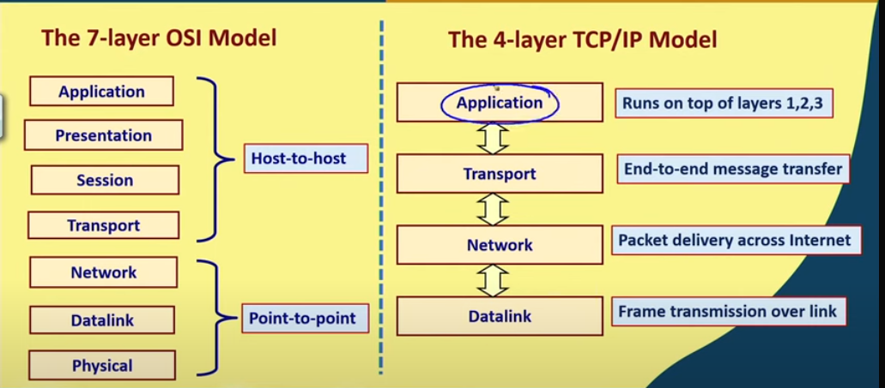
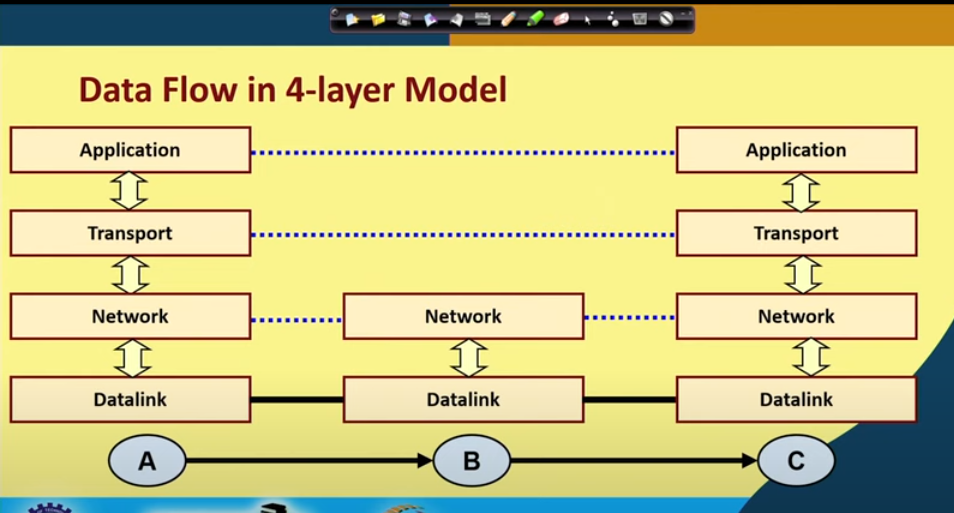
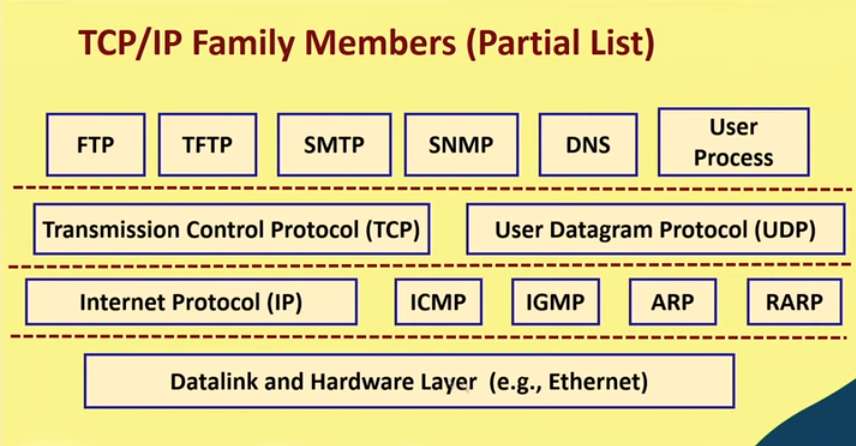
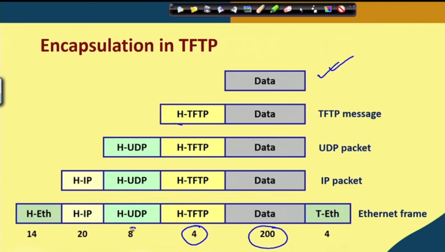
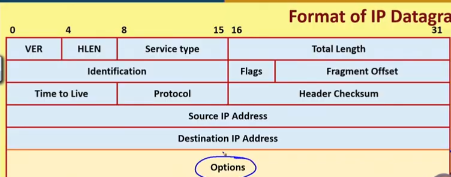

# Introduction to Ethical Hacking

> What is Ethical Hacking?

* It refers to the act of locating weaknesses and vulnerabilities of computer and information systems _by replicating the intent and actions of malicious hackers._

* This is also known as _penetration testing_, _intrusion testing_ or _red teaming._

>Penetration Test
* Legal attempt to break into the comapny's network to find the weak links.
* Tester only report findings, does not provide solutions.

>Security Test
* Also includes analyzing company's security policy and procedures.
* Tester offers solutions to secure or protect the network.

## Basic Terminologies

* **Hacking**: Showing computer expertise.
* **Cracking**: Breaching the security on software or systems.
* **Spoofing**: Faking the originating IP address in a datagram.
* **Denial of Service**: Flooding a host with sufficient network traffic so that it cannot respond anymore.
* **Port Scanning**: Searching for vulnerabilities (from open ports).

## Gaining Access

* Front door:
    * Password Guessing
    * Password/key stealing

* Back doors:
    * Often left (open) by original develoopers as debug and/or diagnostic tools.

* Trojan Horses
    * Usually hidden inside of software that we download and install from the net.
    * Many install backdoors

* Software vulnerability exploitation
    * Often advertised on the OEMs website along with security patches.
    * Fertile ground for script kiddies (noobs) looking for something to do.

## What the hacker can do...

* Modify logs
    * cover all their tracks
* Steal files
* Modify files
* Install backdoors
* Attack other systems

## Penetration testing methodologies

* Tiger Box
    * Collection of OSs and hacking tools.
    * Usually on a laptop
    * Helpts penetration testes and security tester to conduct vulnerabilities assessments and attacks.

* White box model
    * Tester is told everything about the network topology and technology.
    * Tester is authorized to interview IT personnel and company employees.
    * Makes tester's job a little easier.

* Black box model
    * Tester is not given details about the network.
    * Burden is on the tester to find the details.

* Gray box model
    * Hybrid of the white and black box models.
    * Company gives tester partial information.

# Basice Concepts of Networking

* Major types of Computer Networks
    * LAN: same room, building, campus. Faster and Cheaper.
    * WAN: Across campuses, cities, countries, continents. Slower and Expensive.

## Data Communication over a Network

### Circuit switching
* A dedicated communication path established between 2 stations.
    * The path follows a fixed sequence of intermediate links.
    * A logical channel gets defined on each physical link.

* There are 3 steps that are followed
    * Connection establishment
    * Data Transfer
    * Connection termination

* Drawbacks
    * There is initial delay
    * Channel capacity is dedicated ducring the entire duration of communication, This is inefficient as computer data communication is bursty in nature.

### Packet switching
* Modern form of long data communication
    * Network resources are not dedicated
    * All links can be shared
* The basic technology has evolved over time.
* Data are transmitted in short packets.
* Every packet contains a header which is required for routing.
* Packet switching is based on store-and-forward concept.
    * The packets are stored in a buffer in in termediate nodes before transmission.
    * Each intermediate node recieves a whole packet.
    * They also decide the next route
    * Forwards the packet along the selected route.
* Each intermediate node maintains a routing table.

* Advantages:
    1) Links can be shared,
    2) Suitable for bursty traffic
    3) Buffering and data rate conversion can be done
    4) Some packets may be given priority based on user's requests.

>Packets are transmitted using 2 approaches, Virtual circuits and Datagram 

### Virtual Circuit
* Similar to circuit switching
    *  A route is established before packet transmission starts.
    * All packets follow the same path.
    * The links comprising the path are not dedicated

* Working
    * To set up virtual circuit, a _call request packet_ is sent and it also sets up the routing tables.
    * The _call accept packet_ is an ack packet that the virtual circuit has been setup.
    * Route is established a priori.
    * Packet forwarded from 1 node to the next using store-and-forward scheme.
    * Only the virtual circuit number needs to be carried out by the packet.
        1) each intermediate node maintains a table.
        2) Created during route establishment.
        3) Used for packet forwarding.
    * No dynamic routing decesion is taken by the intermediate nodes.

# Basic Concepts of Networking (part-2)

## Data Communication over a Network
### Datagram approach

* No route is established beforehand
* Each packet is transmitted as an independent entity
* Does not maintain any history

* Every intermediate node has to take routing decesions dynamically.
    * Makes use of a routing table
    * Every Packet must contain source and destination adresses.

* Problems:
    * Packets may be delivered out of order
    * if a node crashes momentarily, all of its queued packets are lost.
    * Duplicated packets may also be generated.

* Advantages
    1) Faster than Virtual Circuit for smaller number of packets
    2) More flexible.
    3) Packets between 2 hosts may follow different paths

### Types of delays 

>There are 3 types of delays

1) Propagation delay (based on physical Link)
    * time taken by data signal to propagate from 1 node to the next.
2) Tansmission time (based on Bandwidth)
    * Time taken to send out a packet by the transmitter
3) Processing Delay
    * Time taken by a node to process a packet.

## Layered Network Architecture

### OSI (Open systems interconnection)
> 7 layer model

* Objective:
    * Systematic approach to design
    * Changes in one layer should not require changes in other layer.

* Layers 
    1) Application
    2) Presentation
    3) Session
    4) Transport
    5) Network
    6) Datalink
    7) Physical

7) Physical
    * Transmit raw bit stream over a physical medium
6) Datalink
    * Relaible transfer of frames over a p2p link with flow control and error control
5) Network
    * Establishing, maintaining and terminating connections.
    * Routes packets through p2p links.

4) Transport 
    * End to End reliable data transfer, with error recovery and flow control.
3) Session
    * manages sessions
2) Presentation
    * provides data independence
1) Application
    * Interface point for user applications

### Networking devices

1) Hub (Physical layer)
    * Extends the span of a single LAN.
2) Bridge (at the Data Link layer)
    * Connects 2 or more LAN's together
3) Router (Network layer)
    * Connects any combination of LANs and WANs.

## TCP/IP protocol stack

* TCP/IP Started in 1970 by Advanced Research Project Agency (ARPA) funded by US Military.
* It contains a 4 layer model.

### TCP/IP Protocol Suite

* The protocols are built on top of connectionless technology (datagrams)
    * Data is sent from one node to another as a sequence of datagrams.
    * Each datagram is sent independently.
    * The datagrams corresponding to same message may follow different routes.

* ARP
    * Maps IP address to MAC address
* RARP
    * converts MAC to IP address
* ICMP
    * A network device can send error messages and other information.
* IGMP
    * A node can send multicast group membership to adjacent routers.

### IP
* Routing od packets from source to destination
* Breaks a packet into smaller packets.
* Unreliable service
    * A packet may be lost in transit
    * Packet duplication.
    * Packets arriving out of order

### TCP
* Provides a connection-oriented, reliable service
* Split a message into packets
* Reassemble packets at destination
* resend packets that were lost in transit
* Error control is done by TCP

### UDP
* PRovides a conectionless, unreliable service for sending datagram packets
* messages small enough to fit in a packet
* simpler and faster than TCP
* Never split data into multiple packets
* Does not care about error control

### Encapulation in TFPT

## IP layer

* provides connectionless and unreliable packet delivery system
* Each packet is independent of one another.
* Each packet contains a IP layer encapsulation (typically 20 bytes of header)

## Packet Sniffers
* Wireshark
* Tcpdump
* Wndump
* SolarWinds
