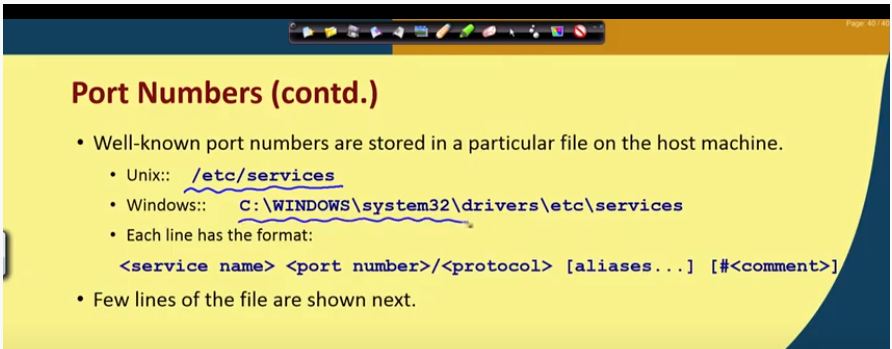
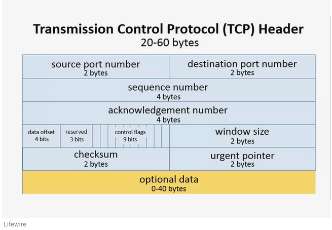

# IP addressing and Routing

## IP packet fragmentation

* Each layer imposes some maximum size of packets called as Maximum Transfer Unit.
* Fragmentation is required when a large packet travels throught a network whose MTU is too small.
* Each fragmanr is transmitted as a separate packet.
* Fragmentation is done by routers
* there are 2 types of fragmentation: Transparent and non transparent

### Transparent fragmentation
* Networks are not even aware that fragmentation has occured.
* All fragments sent to same exit router.
* A packet may get fragmented several times.
* Exit router reassembles the fragments before forwarding to the next network.

Drawbacks:
* All packets must be routed to same router (possibility of overloading)
* Exit router must know when all packet pieces have arrived
* lot of overhead.

### Non-Transparent fragmentation

* Packets are not reassmbled in the intermediate networks
* Each fragment is treated as a independent packet
* The fragments are reassembled at the destination
* IP uses Non-Transparent fragmentation.

Advantages:
* Multiple exit router used
* Higher throughput

Disadvantages:
* Increase in overhead for larger packets
* Each fragment should contain IP header

> Fragmentation problems... refer week2 L1, 23:00 mins

* Ethernet has a maximum frame size of 1500 bytes.
* Therefore to reduce fragmentation in further layers, IP limits the packets fragmentation size to 1500 bytes

## IP addressing and Routing

* IP address is a 32 bit number.
* Each octet is seperated by a "." like W.X.Y.Z. (ex: 66.134.48.126)
* IP address consists of A network number and A host number.
* This partition defines the IP address classes.

### Heirarchical addressing
* When routing to destination network only the network number is looked at.
* Inside destination network only the host number is looked at.

There are 5 defined IP address classes.
* Class A UNICAST
* Class B UNICAST
* Class C UNICAST
* Class D MULTICAST
* Class E RESERVED

>Class D address range: 244.0.0.0 to 239.255.255.255

## TCP and UDP protocol

* TCP and UDP both use IP layer for packet delivery.

### ROLE of TCP

* provides connection oreinted, reliable, full-duplex, byte stream service.
* TCP provides reliability by using
    * checksum
    * Acknowledgements
    * timeouts
    * Control flow 
* It also handles establishment and termination of connections and sequencing of data that mugh reach the destination in arbitrary order.

### Role of UDP

* Connectionless and unreliable service.
* Checksum to verify integrity of the packet
* Port numbers to identify destination.

## Port Numbers

* TCP and UDP uses 16 bit integer port numbers
* different applications are identified by different port numbers.
* Port numbers are stored in header of TCP and UDP packets.

* Temporary port numbers are called ephemeral port number

>During Connection establishment a heirarchical scheme is used, First IP address is defined, then Protocol identifier (TCP/UDP) and then Port numbers are defined.

A set of 5 values that describe a unique process to process connection is called an association.

* Protocol (TCP/UDP)
* Local Host IP address
* Local Port Number
* Remote host IP address
* Remote Port Number

## TCP and UDP headers

### TCP header

### UDP header

## IP Subnetting

### IP subnets and mask

* A subnet is a subnet of a class A, B or C network.
* IP subnets introduces a 3rd level of hierarchy using network masks.
    * a network portion
    * a subnet portion
    * a host portion

>Natural masks are the normal IP classes. Class A - 255.0.0.0, Class B - 255.255.0.0, Class C - 255.255.255.0

* Masks are very flexible
* Can create a large number of subnets from one network
* Can have less number of hosts per network.

>refer week 2 Lecture 5 for problems

### Variable length Subnet mask

* Can have subnets of different sizes.
* Allows bettwe use of address space

### Classless Internet Domain Routing (CIDR)

* No concepts of classes
* Reduces sizes of routing table
* An IP address is represented by a prefix,  which is the IP address of the network

>Ex: 244.26.192.64 / 18 -> 18 bit mask.

* The number of addresses in each block must be in powers of 2
