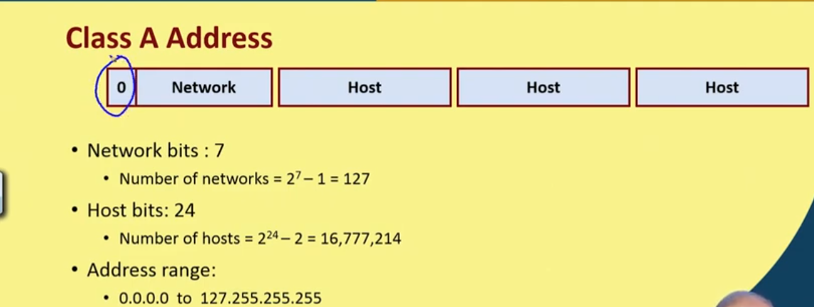
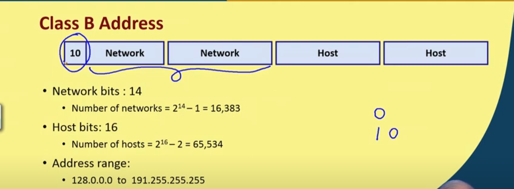
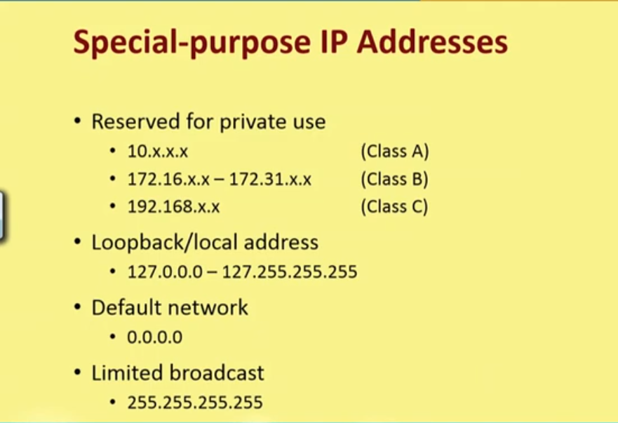
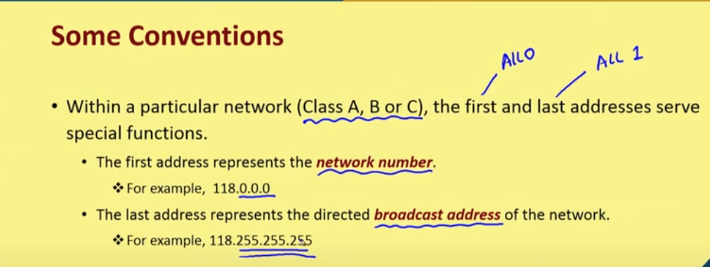

# IP addressing and Routing

## IP packet fragmentation

* Each layer imposes some maximum size of packets called as Maximum Transfer Unit.
* Fragmentation is required when a large packet travels throught a network whose MTU is too small.
* Each fragmanr is transmitted as a separate packet.
* Fragmentation is done by routers
* there are 2 types of fragmentation: Transparent and non transparent

### Transparent fragmentation
* Networks are not even aware that fragmentation has occured.
* All fragments sent to same exit router.
* A packet may get fragmented several times.
* Exit router reassembles the fragments before forwarding to the next network.

Drawbacks:
* All packets must be routed to same router (possibility of overloading)
* Exit router must know when all packet pieces have arrived
* lot of overhead.

### Non-Transparent fragmentation

* Packets are not reassmbled in the intermediate networks
* Each fragment is treated as a independent packet
* The fragments are reassembled at the destination
* IP uses Non-Transparent fragmentation.

Advantages:
* Multiple exit router used
* Higher throughput

Disadvantages:
* Increase in overhead for larger packets
* Each fragment should contain IP header

> Fragmentation problems... refer week2 L1, 23:00 mins

* Ethernet has a maximum frame size of 1500 bytes.
* Therefore to reduce fragmentation in further layers, IP limits the packets fragmentation size to 1500 bytes

## IP addressing and Routing

* IP address is a 32 bit number.
* Each octet is seperated by a "." like W.X.Y.Z. (ex: 66.134.48.126)
* IP address consists of A network number and A host number.
* This partition defines the IP address classes.

### Heirarchical addressing
* When routing to destination network only the network number is looked at.
* Inside destination network only the host number is looked at.

There are 5 defined IP address classes.
* Class A UNICAST
* Class B UNICAST
* Class C UNICAST
* Class D MULTICAST
* Class E RESERVED

>Class D address range: 244.0.0.0 to 239.255.255.255

