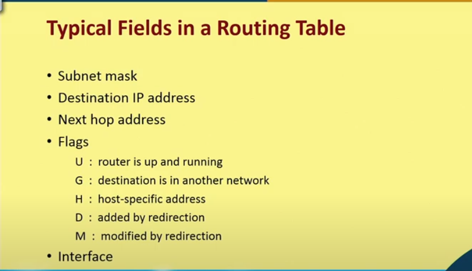
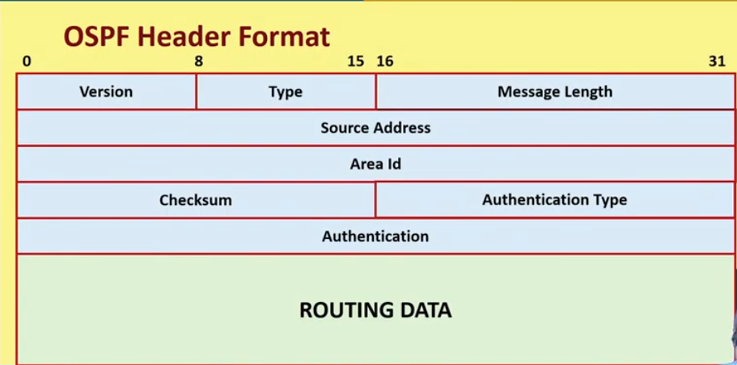
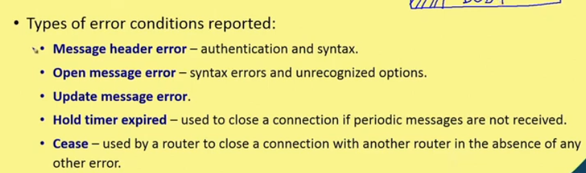
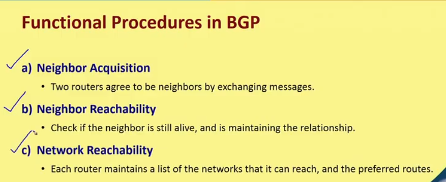
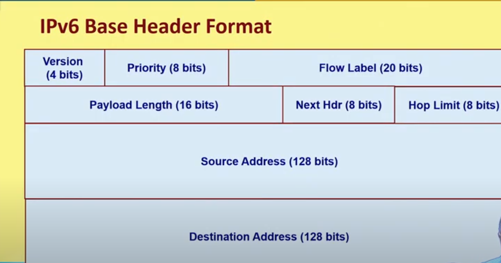
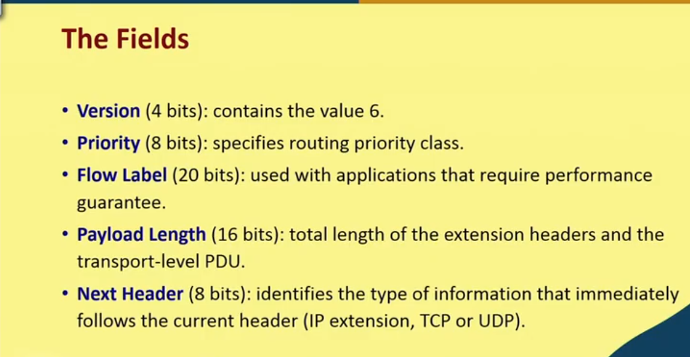
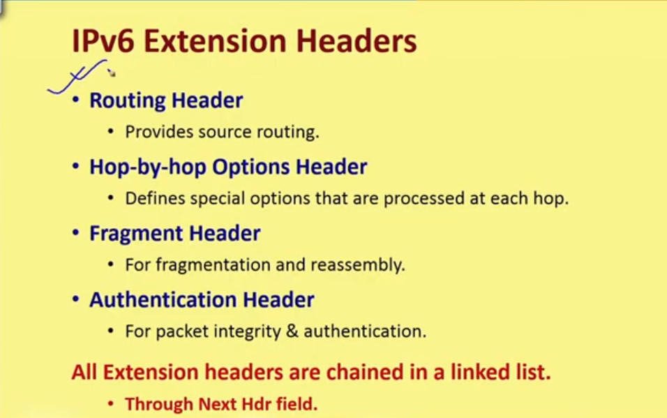
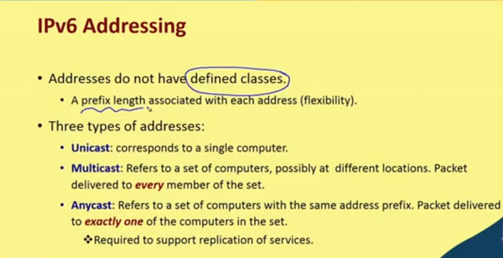
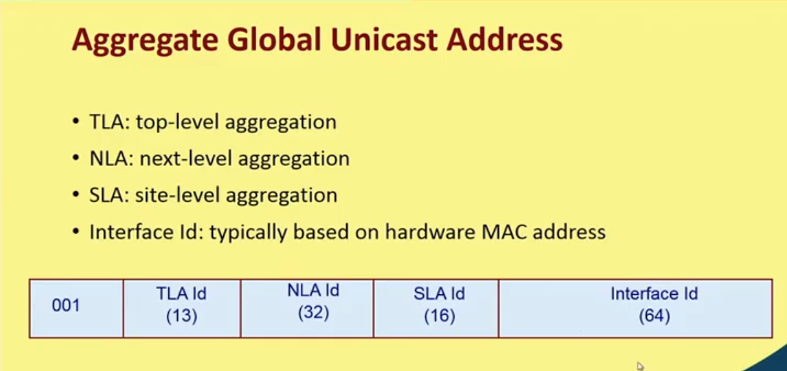

# Routing Protocols

## Packet delivery options

* Host to Host (when hosts are in same network)
* Router to Host (when hosts are in different network)

### Connection optiond
* Connection oriented
* Connection-less

### Routing methods
* Next hop (next router)
* Network specific (all hosts in the network)
* Host specific (a particular host)
* Default (none of the above)

### Types of Routing tables

* Static 
    * contains information inserted manually
    * DOes not change with time
* Dynamic
    * Updated periodically depending on network condition
    * Uses protocols like RIP, OSPF, BGP etc.

### Routing table fields

### Interior and Exterior routing protocols

#### Interior
* Routing information Protocol (RIP)
* Open Shortest Path First (OSFP)

#### Exterior 
* Border Gateway Protocol

#### Autonomous System
* A set of routers and networks managed by a single organization
* The routers within AD exchange information using a common routing protocol
* The AS graph is connected (in the absence of failure)
* Every AS is assigned by unique AS number
* Routing protocols used within AS are interior routing protocols and across other AS's exterior routing protocols are used.

#### RIP
* Distance Vector routing using hop count
* Table entries updated using values received from neighbors.
* Maintain timers to detect dailed links
* Used in 1st generation ARPANET

>Drawbacks: Slow convergence; Long time for routers to know about link failures; Too much bandwidth consumed by routing update; Also has counting to infinity problem

#### OSPF
* Widely used in TCP/IP
* Updates routing tables based on link state advertisement
* Computes routes based on least cost; based on delay, data rate and cost
* Each router mainains dataases of topology and connections of routers

>Vertices are routers and other network; Edges are direct point to point link
* OSPF uses Dijkstra's algorithm to compute least cost path
* Only next hop to the destination is used in the fowarding process

* Every router sends a "Hello" packet are sent to Neighbors every 10 seconds
* Link State Advertisement (LSA) flooded initially from each router.
* Absence of "Hello" packet for 40 seconds indicate failure of neighbour
* LSAs are re-flooded every 30 min

* OSPF packet types
    * Hello packet
    * Database Description: To synchronize the database in the beginning
    * Link State Request
    * Link State Update
    * Link State Acknowledgement

### Exterior Routing protocols

#### Border Gateway Protocol

* Allows routing belonging to different AS to exchange routing information.
    * Sent as a message over TCP connections
    * To update the routing tables

* Currently works on version 4
* Inter AS routing carried out
* works on TCP port 179
* Uses distance vector Protocol and unlike RIP, BGP contains complete routes

* Message types of BGP
    * Open : used to open a nrighnor connection with another router
    * Update : used to transmit info about route, advertise new routes and withdraw infeasible paths
    * Keepalive : Used to confirm neighbor connection
    * Notification : Used to notify some error condition

* BGP peers exchange entire routing table with neighbors
* After that only incremental updates are sent as the routing table changes
* Keepalive messages are sent periodically
* Notification messages are sent to flag errors

#### Functional procedure of BGP

## IPv6

### Dr

* Limited address space (32-bit addresses)
* Applications demanding real time response
    * Must avoid changing routes frequently
* Need for more complex addressing and routing capabilities
    * 2 level structure of IPv4 may not serve the purpose.

### Features

* Common features are: 
    * Connectionless protocol
    * Header contains TTL
    * Some of the other general characteristics are also retained

* New Features
    * 128 bit address size for devices
    * Uses a series of fixed-length headers to handle optional information.
    * A datagram consists of a base header followed by 0 or more extension headers
    * Support for real time traffic
    * Allows a pair of stations to establish high quality path
    * Increased flexibility in addressing
    * Includes the concept of an anycast address, where a packet is delivered to one of a set of nodes
    * Provides dynamic assignment of IP adresses

* An IP datagram has a base header, followed by 0 or more extension headers, followed by the data

>IPv6 Uses colon-hexadecimal notation. Each group of 16 bits written in hex, with a colon separating groups.

