# Installation and network setup

## Information Gathering

### Reconnaissance

>It is the process of collectoin as much information as possible about a target network.

* Required for identifying ways to intrude into the victim's networks system
* It is the first step before mounting any attack
1) Collect useful info about target PC
    * Such as IP addresses, list of open ports, secure ports, vulnerability, etc.
2) Collect network info
    * Domain name, IP, internal domain name, services running(TCP, UDP)
3) Collect system info
    * User names, routing tables, system architecture, passwords, etc.
4) Collect organization info
    * Employee details, organization names, location, contact info, security policies, etc.

>There are 2 types of Reconnaissance, Active and Passive

### Passive Reconnaissance

In this type of info gathering, we collect info about the target indirectly
* Without direct communication with the target system.
* Collection of the data that are publically available for webpage/application
* we can collect information using 3rd party tools
* we can alse use search engine and search operator available with search engine.

### Active Reconnaissance

In this method info is gathered directly by communicating with the victim system
* This can provide more detailed information about target machine. But as we are directly communicating with target, there is a risk of detection.
* Can be carried out by using NMAP, Nessus, Metasploit framework, etc.
* We can also use Mail tracker and DNS enumeration, Email enumeration etc.

### Common sources of info for Passive Reconn

1) archive.org website can provide complete history of any website like when it was updated etc.
    * We can go back to the particular date and observe the webpage.
    * we can mirror the website which will load all the files locally, such as HTML codes, images etc, that can be used to observe directories used.

2) Whois database provides the following details from the target's IP address
    * Registration details
    * IP address
    * Contact number and mail ID
    * Domain Owner
    * Name Servers
    * Regional internet Registries

3) Netcraft an internet service company
    * Through Netcraft we can find the list of subdomains and OS of the corresponding server.
    * This can be useful while exploiting the system.

4) Search Engine and Search Operator
    * Using search engine, we can extract info such as platform used by organization, employee details, login pages.
    * We can also extract some info from search engine cache and internet archives.

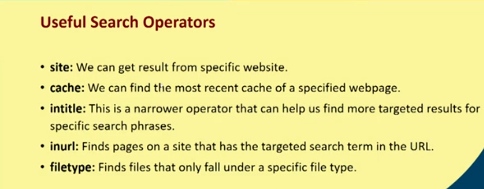

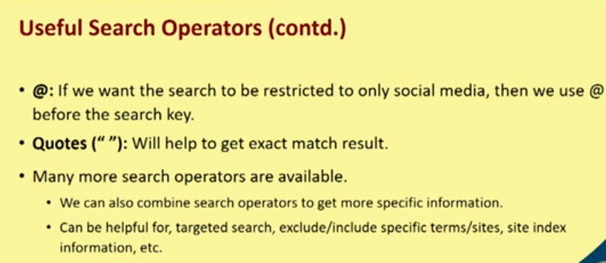

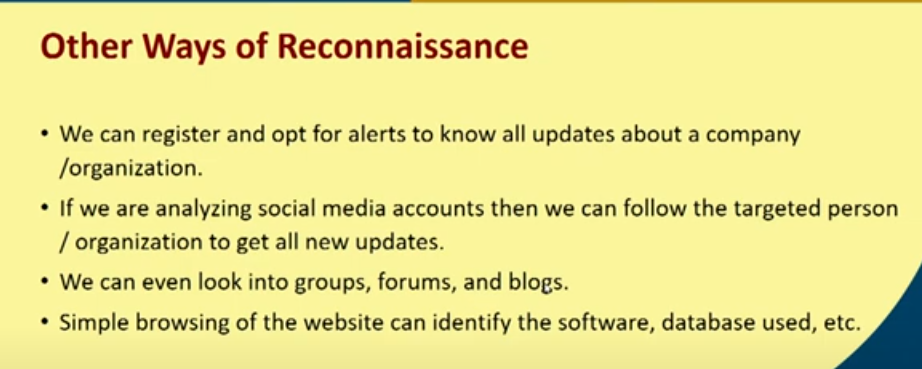

### Active Reconn

1) DNS and Mail Server Enumeration
    * In enumeration, Attackers create active connections to the system and performs directed queries to gain more info about the target
    * DNS/Mail Server enumeration is the process of locating all DNS servers and their corresponding records for an organisation.
    * This can yeild usernames, computer names, IP addresses of the potential target systems.
    * It can also reveal the size of the organization that can translate to the potential size of the attack.
    * Tools used are nslookup, host, dig, etc.

2) Port Scanning
    * In active reconn scanning tools performs major role. Scanning can be used to detect:
    * Live host in a network and network infra
    * Open ports
    * Services running in some particular port
    * OS of the target machine
    * Vulnerabilities of network/application/OS/target system.
    * Tools used are NMAP, ZenMap, Nessus, Nexpose, etc.

### Intro to NMAP

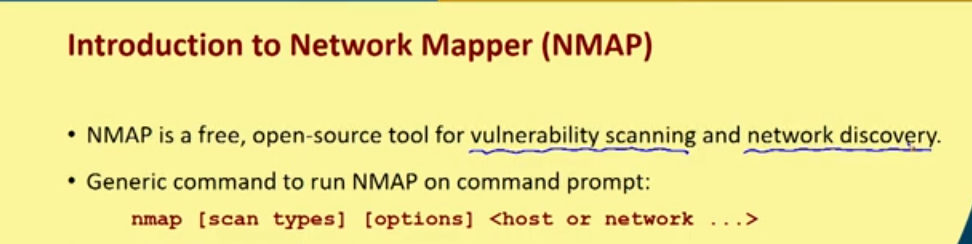

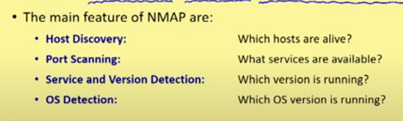

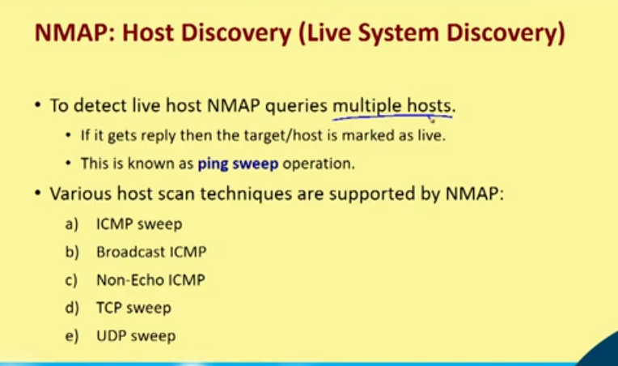

1) ICMP SWEEP

* Easy to implement
* Slow
* Easy to block

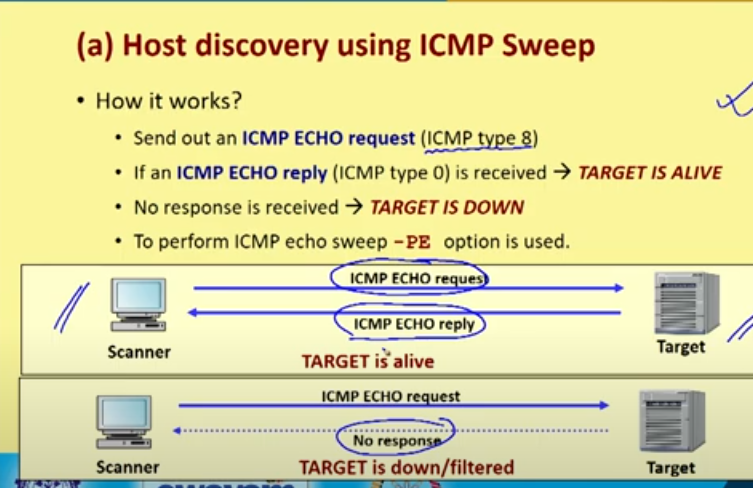

2) Host discovery using ICMP

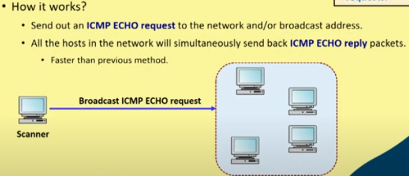

3) Host discovery using Non-ECHO ICMP

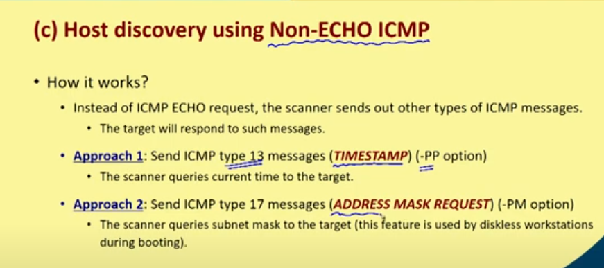

4) Host discovery using TCP sweep

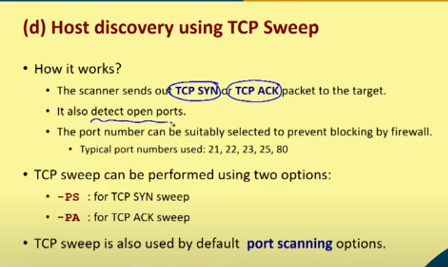

5) Host discovery using UDP sweep

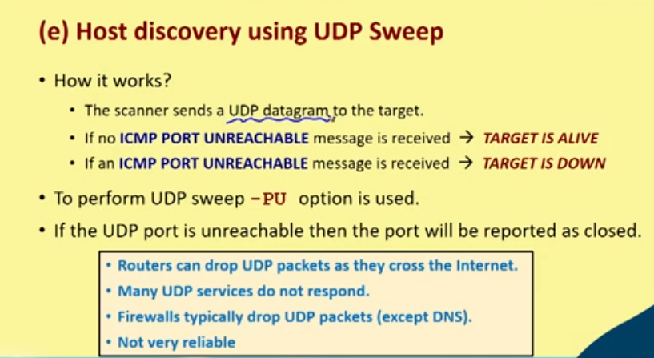

### Port scanning using NMAP

* To determine what services are running or Listen-ing
    * each running TCP service is associated with a port number, which listens for incoming connectins
    * Each running UDP service is associated with a port number

* Various port scanning techniques in NMAP are:
    1) TCP Connect Scan
    2) TCP SYN Scane
    3) TCP Stealth Scan
    4) FTP Bounce Scan

1) TCP Connect Scan

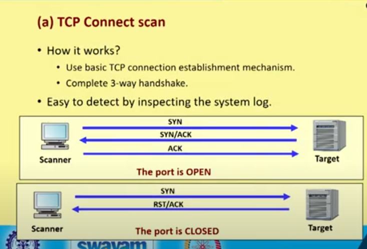

2) TCP SYN

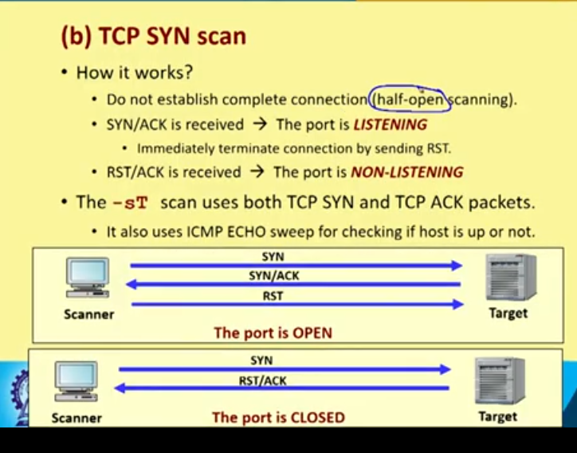

3) TCP Stealth

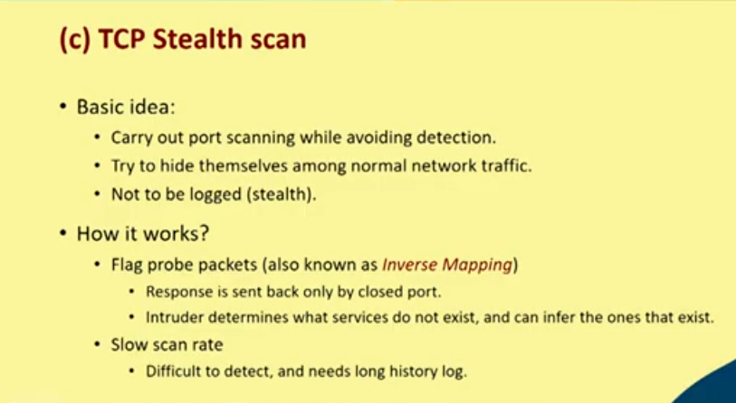
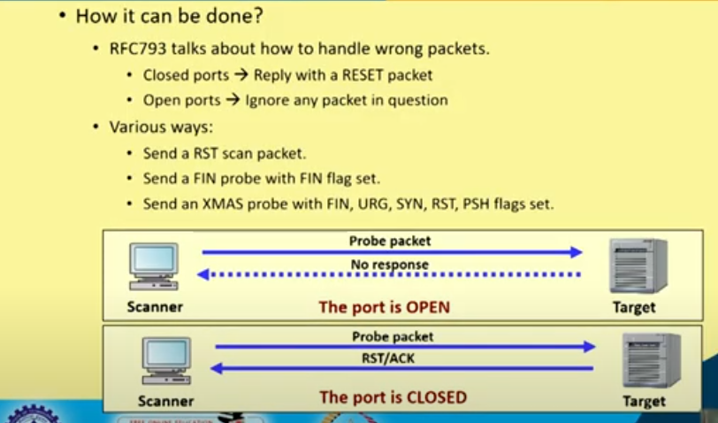

4) FTP bounce

### Features of NMAP

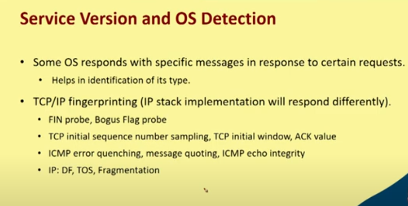

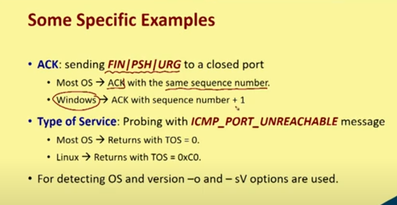

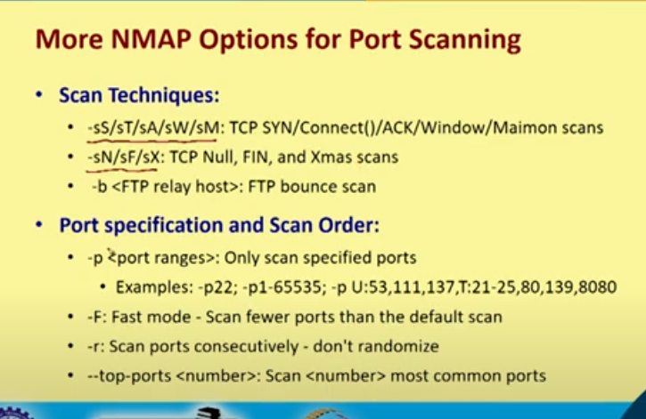

### Counter measures for Reconn

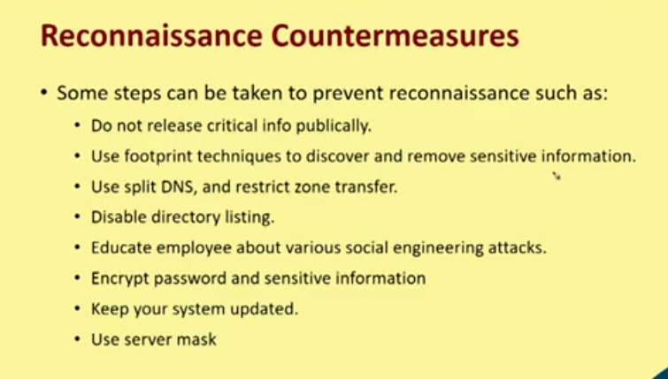
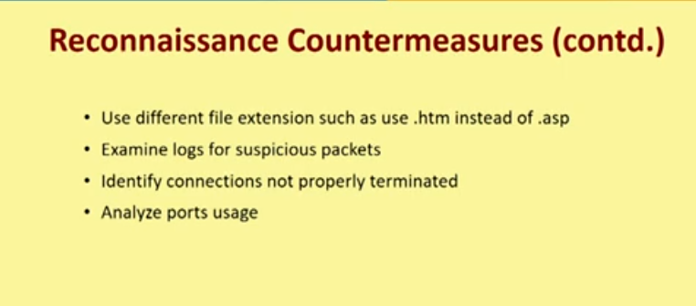