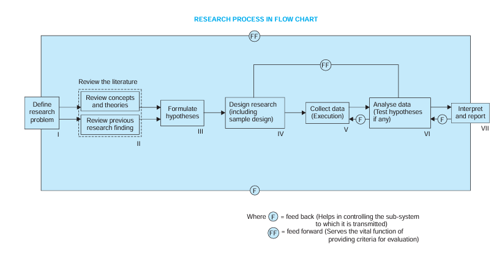

# Assignment

Descriptive and analytical research methods are two fundamental approaches in research, each serving distinct purposes and employing different techniques.

### **Descriptive Research Methods**
Descriptive research is primarily concerned with describing characteristics, phenomena, or patterns within a particular population or situation. It seeks to answer the "what" of a subject without necessarily delving into the "why" or "how."

**Key Characteristics:**
- **Objective:** To observe, describe, and document aspects of a situation as it naturally occurs.
- **Approach:** It often involves collecting data through surveys, observations, case studies, or correlational studies.
- **Outcome:** Provides a detailed account or profile of a situation, event, or group.
- **Use Cases:** Useful for studies where the goal is to identify trends, frequencies, and relationships among variables without determining cause-effect relationships.

**Examples:**
- A survey that reports the percentage of people who prefer online shopping over in-store shopping.
- A case study detailing the characteristics of a successful startup.

### **Analytical Research Methods**
Analytical research goes beyond description to explore relationships and causes. It seeks to explain the "how" and "why" of a phenomenon by analyzing the underlying components and their interactions.

**Key Characteristics:**
- **Objective:** To investigate cause-and-effect relationships or to understand complex phenomena by breaking them down into their components.
- **Approach:** It often involves statistical analysis, hypothesis testing, experiments, or comparative studies.
- **Outcome:** Provides insights into the underlying factors, processes, and mechanisms that drive a particular outcome or trend.
- **Use Cases:** Used when the goal is to determine causal relationships, test hypotheses, or predict outcomes based on certain variables.

**Examples:**
- A study that analyzes the factors contributing to the success of online marketing strategies.
- An experiment that tests the effectiveness of a new drug compared to a placebo.

### **Comparison:**

- **Purpose:**
  - *Descriptive:* To describe and document.
  - *Analytical:* To analyze and explain.
  
- **Data Collection:**
  - *Descriptive:* Surveys, observations, case studies.
  - *Analytical:* Experiments, statistical analysis, hypothesis testing.
  
- **Outcome:**
  - *Descriptive:* Provides a picture of a situation.
  - *Analytical:* Provides explanations and understanding of relationships.

In essence, descriptive research provides the foundation by documenting what is happening, while analytical research builds upon this foundation to explain why it happens.

Applied and fundamental (or basic) research methodologies are two distinct approaches to scientific inquiry, each with different objectives, methods, and outcomes.

### **Applied Research Methodologies**
Applied research is focused on practical problem-solving. It aims to address specific, real-world issues by applying existing knowledge to develop solutions, products, or processes.

**Key Characteristics:**
- **Objective:** To solve practical problems and improve human conditions by applying research findings to real-world situations.
- **Approach:** Often involves direct application of theories and techniques to develop new technologies, processes, or interventions.
- **Outcome:** Produces tangible outcomes such as products, technologies, processes, or recommendations that have immediate practical utility.
- **Use Cases:** Commonly used in fields like engineering, medicine, business, and social sciences, where the goal is to develop solutions to specific problems.

**Examples:**
- Developing a new vaccine to combat a particular disease.
- Creating more efficient manufacturing processes to reduce waste.
- Designing a marketing strategy to increase consumer engagement.

### **Fundamental (Basic) Research Methodologies**
Fundamental research, also known as basic or pure research, is focused on advancing knowledge and understanding of underlying principles without immediate practical applications in mind. It seeks to expand the theoretical foundation of a particular field.

**Key Characteristics:**
- **Objective:** To generate new knowledge, theories, or principles by exploring fundamental aspects of phenomena without a focus on practical application.
- **Approach:** Involves theoretical exploration, experimentation, and hypothesis testing to understand underlying mechanisms, principles, and laws.
- **Outcome:** Contributes to the broader knowledge base of a field, often serving as a foundation for future applied research.
- **Use Cases:** Common in academic and scientific research, particularly in fields like physics, chemistry, biology, and mathematics, where the goal is to uncover new insights or principles.

**Examples:**
- Investigating the properties of subatomic particles to understand the fundamental forces of nature.
- Exploring the cognitive processes involved in learning and memory.
- Studying the genetic basis of certain diseases without focusing on immediate treatment development.

### **Comparison:**

- **Purpose:**
  - *Applied:* To address specific, practical problems.
  - *Fundamental:* To expand knowledge and understanding of basic principles.
  
- **Application:**
  - *Applied:* Directly linked to practical outcomes and solutions.
  - *Fundamental:* Primarily theoretical, with potential future applications.
  
- **Outcome:**
  - *Applied:* Produces usable solutions, products, or processes.
  - *Fundamental:* Advances the theoretical knowledge base of a field.

### **Relationship Between the Two:**
- Fundamental research often serves as the groundwork for applied research. Discoveries made in basic research can later be used to develop practical applications.
- Applied research can also generate new questions that lead to further fundamental research.

In essence, fundamental research seeks to understand "why" and "how" something happens, while applied research takes that understanding and figures out "how" it can be used to solve real-world problems. Both are essential to scientific progress, with each informing and supporting the other.

Quantitative and qualitative research methodologies are two primary approaches to collecting and analyzing data, each with distinct purposes, techniques, and types of data.

### **Quantitative Research Methodologies**
Quantitative research focuses on quantifying variables and using statistical methods to identify patterns, relationships, and causality. It is rooted in objectivity and aims to produce numerical data that can be analyzed mathematically.

**Key Characteristics:**
- **Objective:** To quantify variables, measure relationships, and test hypotheses using statistical analysis.
- **Approach:** Involves structured data collection methods, such as surveys, experiments, or questionnaires, with predetermined response options.
- **Data Type:** Numerical data that can be quantified and subjected to statistical analysis.
- **Outcome:** Provides generalizable results that can be used to make predictions or identify trends.
- **Use Cases:** Common in fields like psychology, economics, sociology, and natural sciences, where measurement, comparison, and statistical analysis are essential.

**Examples:**
- A survey measuring customer satisfaction on a scale from 1 to 10.
- An experiment testing the effect of a new drug on blood pressure, with results expressed in numerical values.
- Analyzing the correlation between years of education and income levels.

**Techniques:**
- Surveys and questionnaires with closed-ended questions.
- Structured observations.
- Statistical analysis (e.g., regression, correlation, t-tests).

### **Qualitative Research Methodologies**
Qualitative research focuses on exploring and understanding phenomena through rich, detailed descriptions and interpretations. It seeks to provide deeper insights into people's experiences, behaviors, and social contexts.

**Key Characteristics:**
- **Objective:** To explore and understand complex phenomena, behaviors, and social processes through detailed, narrative data.
- **Approach:** Involves unstructured or semi-structured data collection methods, such as interviews, focus groups, or observations, allowing for flexibility in responses.
- **Data Type:** Non-numerical data, such as text, audio, or video, that are rich in detail and context.
- **Outcome:** Provides in-depth understanding, insights, and interpretations of specific cases or contexts.
- **Use Cases:** Common in fields like anthropology, sociology, psychology, and education, where understanding the meaning and context of human experiences is crucial.

**Examples:**
- Conducting in-depth interviews to understand patients' experiences with chronic illness.
- Analyzing themes in participants' responses during focus groups on consumer behavior.
- Observing classroom interactions to study teacher-student dynamics.

**Techniques:**
- Open-ended interviews.
- Participant observations.
- Content analysis of texts or media.

### **Comparison:**

- **Purpose:**
  - *Quantitative:* To measure and quantify variables, and test hypotheses.
  - *Qualitative:* To explore and understand meanings, experiences, and social phenomena.
  
- **Data:**
  - *Quantitative:* Numerical, can be statistically analyzed.
  - *Qualitative:* Narrative or descriptive, analyzed for themes and patterns.
  
- **Approach:**
  - *Quantitative:* Structured, with predetermined methods and instruments.
  - *Qualitative:* Flexible, with methods evolving during data collection.
  
- **Outcome:**
  - *Quantitative:* Generalizable results, trends, and patterns.
  - *Qualitative:* In-depth insights, contextual understanding.

### **Complementarity:**
- Quantitative research can provide broad generalizations, while qualitative research offers depth and context.
- Mixed-methods research combines both approaches to benefit from the strengths of each, offering both breadth and depth in understanding research questions.

In essence, quantitative research is about measuring and analyzing data in a way that can be expressed numerically, while qualitative research is about exploring and understanding the deeper meanings and experiences behind those numbers. Both are valuable and often complementary in research.

Conceptual and empirical research methodologies represent two different approaches to generating knowledge and understanding phenomena, each with distinct characteristics, purposes, and methods.

### **Conceptual Research Methodologies**
Conceptual research is primarily focused on developing theories, models, or frameworks by analyzing and synthesizing existing ideas, concepts, and knowledge. It does not rely on direct observation or experimentation but instead uses logical reasoning and argumentation to advance understanding.

**Key Characteristics:**
- **Objective:** To develop new theories, concepts, or models, or to refine existing ones by exploring ideas and relationships between concepts.
- **Approach:** Involves analysis, synthesis, and interpretation of existing literature, theories, and concepts without necessarily collecting new empirical data.
- **Data Type:** Relies on secondary data, such as academic papers, books, and existing theories, rather than primary data from experiments or observations.
- **Outcome:** Provides theoretical insights, frameworks, and models that can be used to guide future research or practical applications.
- **Use Cases:** Common in fields like philosophy, theoretical physics, economics, and any domain where understanding and organizing ideas is key.

**Examples:**
- Developing a new theoretical framework for understanding consumer behavior.
- Proposing a new model of leadership based on the synthesis of existing leadership theories.
- Conceptualizing the idea of "justice" in political philosophy.

**Techniques:**
- Literature review.
- Theoretical analysis.
- Logical reasoning and argumentation.

### **Empirical Research Methodologies**
Empirical research is focused on collecting and analyzing data through direct observation, experimentation, or experience. It is grounded in the idea that knowledge comes from sensory experience, and it relies on measurable evidence.

**Key Characteristics:**
- **Objective:** To gather evidence and test hypotheses by observing and measuring real-world phenomena.
- **Approach:** Involves collecting primary data through experiments, surveys, observations, or other empirical methods.
- **Data Type:** Uses primary data that can be observed or measured, often numerical or descriptive.
- **Outcome:** Provides evidence-based conclusions, validates theories, and informs decision-making based on real-world data.
- **Use Cases:** Common in natural sciences, social sciences, psychology, and any field where direct observation or experimentation is essential.

**Examples:**
- Conducting an experiment to test the effectiveness of a new teaching method.
- Surveying a population to gather data on voting behavior.
- Observing animal behavior in a natural habitat to study social structures.

**Techniques:**
- Experiments.
- Surveys and questionnaires.
- Observations and field studies.

### **Comparison:**

- **Purpose:**
  - *Conceptual:* To develop and refine theories or models.
  - *Empirical:* To test theories, gather evidence, and provide factual data.
  
- **Data:**
  - *Conceptual:* Secondary data, ideas, and theories.
  - *Empirical:* Primary data collected through observation, experimentation, or measurement.
  
- **Outcome:**
  - *Conceptual:* Theoretical frameworks, models, or hypotheses.
  - *Empirical:* Evidence-based findings, validation of theories, or discovery of new phenomena.

### **Relationship Between the Two:**
- Conceptual research often lays the groundwork for empirical research by developing hypotheses or frameworks that can be tested through empirical methods.
- Empirical research can validate, refine, or challenge conceptual models, leading to further theoretical development.

In essence, conceptual research is about thinking and theorizing, providing the ideas and frameworks that shape our understanding, while empirical research is about doing and observing, collecting the data that supports or refines those ideas. Both approaches are essential to advancing knowledge and understanding in any field.

# Actual notes starts here

>Direct preparation for internals

## 1. Describe the Various stages involved in the Research process

Research process consists of series of actions or steps necessary to effectively carry out research. The following are the various steps of research process.
1. Formulating the research problem.
2. Extensive literature survey.
3. Developing the hypothesis.
4. Preparing the research design.
5. Determining sample design.
6. Collecting the data.
7. Execution of the project.
8. Analysis of data.
9. Hypothesis testing.
10. Generalisations and interpretation.
11. Preparation of the report or presentation of the results, i.e., formal write-up of conclusions reached.
A brief description of the above stated steps will be helpful.

1. Formulating the research problem/: Identify the Problem
A research problem identifies your destination: it should tell about you, your research supervisor and your readers what you intend to research.
  1. The first step in the process is to identify a problem or develop a research question. There are two types of research problems, viz., related to i) states of nature and ii) relationships between variables.
  2. A researcher must decide the general area of interest or aspect of a subject-matter to study. This serves as the focus of the study.
  3. Essentially two steps are involved in formulating the research problem, viz., understanding the problem thoroughly and rephrasing the same into meaningful terms from an analytical point of view.
  4. The best way of understanding the problem is to discuss it with one’s own colleagues or with some expertise in the matter.
  5. In an academic institution the researcher can seek the help from a guide who is usually an experienced man and has several research problems in mind.
  6. The task of formulating, or defining, a research problem is a step of greatest importance in the entire research process.
2. Extensive literature survey/ Review the Literature
  1. Once the problem has been identified, a brief summary (synopsis) of it should be prepared. It is compulsory for a research worker writing a thesis for a Ph.D degree. The synopsis of the topic is to be submitted to the necessary Committee or the Research Board for approval.
  2. To do this, the researcher must review the literature related to the research problem. This step provides foundational knowledge about the problem area.
  3. The review of literature also educates the researcher about what studies have been conducted in the past, how these studies were conducted, and the conclusions in the problem area.
3. Development of working hypotheses
  1. After extensive literature survey, researcher should state in clear terms the working hypothesis or hypotheses. It is the focal point for research
  2. The development of working hypothesis plays an important role.
  3. Hypothesis should be very specific and limited to the piece of research in hand because it has to be tested. The role of the hypothesis is to guide the researcher by delimiting the area of research and to keep him on the right track. It sharpens his thinking and focuses attention on the more important facets of the problem.
The development of working hypotheses can be developed by using the following approach:
  * Discussions with colleagues and experts about the problem, its origin and the objectives in seeking a solution;
  * Examination of data and records, if available, concerning the problem for possible trends, peculiarities and other clues;
  * Review of similar studies in the area or of the studies on similar problems; and
  * Exploratory personal investigation which involves original field interviews on a limited scale with interested parties and individuals with a view to secure greater insight into the practical aspects of the problem.

4. Preparing the research design
The researcher is required to prepare a research design. There are several research designs, such as, experimental and non-experimental hypothesis testing. Experimental
designs can be either informal designs or formal designs, out of which the researcher must select one for his own project.
The preparation of the research design, appropriate for a particular research problem, involves usually the consideration of the following:
  1. The means of obtaining the information;
  2. The availability and skills of the researcher and his staff (if any);
  3. Explanation of the way in which selected means of obtaining information will be organized and the reasoning leading to the selection;
  4. The time available for research; and
  5. The cost factor relating to research, i.e., the finance available for the purpose.

5. Determining sample design
The way of selecting a sample is popularly known as the sample design. In other words, a sample design is a definite plan determined before any data are actually collected. Samples can be either probability samples or non-probability samples.
* The probability samples are those based on simple random sampling, systematic sampling, stratified sampling, cluster/area sampling.
* The non-probability samples are those based on convenience sampling, judgement sampling and quota sampling techniques.
A brief mention of the important sample designs is as follows:
  1. Deliberate sampling
Deliberate sampling is also known as purposive or non-probability sampling. Judgement sampling is used quite frequently in qualitative research where the desire happens to be to develop hypotheses rather than to generalise to larger populations.
  2. Simple random sampling
This type of sampling is also known as chance sampling or probability sampling. In this each and every item in the population has an equal chance of inclusion in the sample.
Ex.: if we have to select a sample of 300 items from a universe of 15,000 items, then we can put the names or numbers of all the 15,000 items on slips of paper and conduct a lottery.
Using the random number tables is another method of random sampling.
Ex.: To select the sample, each item is assigned a number from 1 to 15,000. Then, 300 five digits random numbers are selected from the table.

  3. Systematic sampling
In some instances, the most practical way of sampling is to select every 15th name on a list, every 10th house on one side of a street and so on. Sampling of this type is known as systematic sampling.
  4. Stratified sampling
It is important that the sample includes representative groups of study units with specific characteristics. Ex.: Residents from urban and rural areas. The sampling frame must be divided into groups, or strata, according to these characteristics. Random or systematic samples of a predetermined size will then have to be obtained from each group (stratum). This is called stratified sampling.
  5. Quota sampling
The actual selection of items for the sample is left to the interviewer’s judgement. This is called quota sampling. Quota sampling is an important form of non-probability sampling. Quota samples generally are judgement samples rather than random samples.
  6. Cluster sampling and area sampling
Cluster sampling involves grouping the population. Then the groups or clusters are selecting rather than individual for inclusion in the sample.
Ex.: Suppose a departmental store wishes to sample its credit card holders. It has issued its cards to 15,000 customers. The sample size is say 450. Among 15,000 customers, 100 clusters are formed. Each cluster consists of 150 card holders. Three clusters are selected for the sample randomly.
Under area sampling the total area is to be divided into a number of smaller non- overlapping areas. These are generally known as geographical clusters. Then a number of these smaller areas are randomly selected. All units in these small areas are included in the sample.
  7. Multi-stage sampling
Under multi-stage sampling the first stage may be to select large primary sampling units such as states, then districts, then towns and finally certain families within towns. If the technique of random-sampling is applied at all stages, the sampling procedure is described as multi-stage random sampling.
  8. Sequential sampling
This design is usually adopted under acceptance sampling plan in the context of statistical quality control.

6. Collecting the data
There are several ways of collecting the appropriate data. They are differing considerably in context of money costs, time and other resources of the researcher.
Primary data can be collected either through experiment or through survey. The researcher conducts an experiment and observes some quantitative measurements or the data. With the help of data the truth contained in the hypothesis can be examined.
In the case of a survey, data can be collected by any one or more of the following
ways:
  1. By observation: This method implies the collection of information by way of investigator’s own observation. The information obtained relates only to what is currently happening and is not about either the past or future. This method is no doubt an expensive method. The information provided by this method is also very limited. This method is not suitable for large samples are concerned.
  2. Through personal interview: The investigator follows a rigid procedure and seeks answers to a set of questions through personal interviews. In this method the output depends upon the ability of the interviewer to a large extent.
  3. Through telephone interviews: This method of collecting information involves contacting the respondents on telephone itself. This is not a very widely used method but it plays an important role in industrial surveys in developed regions. Particularly, the survey has to be accomplished in a very limited time.
  4. By mailing of questionnaires: Questionnaires are mailed by the researches to the respondents with a request to return after completing the same. It is the most extensively used method in various economic and business surveys.
  5. Through schedules: Under this method the enumerators are appointed and given training. They are provided with schedules containing relevant questions. These enumerators go to respondents with these schedules. Data are collected by filling up the schedules by enumerators on the basis of replies given by respondents. Much depends upon the capability of enumerators so far as this method is concerned. Some occasional field checks on the work of the enumerators may ensure sincere work.

7. Execution of the project
Execution of the project is a very important step in the research process.
* The data to be collected would be adequate and dependable.
* The project should be executed in a systematic manner and in time.
* The data are to be collected through interviewers.
* The training may be given with the help of instruction manuals. Manuals explain clearly the job of the interviewers at each step.
* A careful watch should be kept for unanticipated factors in order to keep the survey as much realistic as possible.
* The steps should be taken to ensure that the survey is under statistical control So that the collected information is in accordance with the pre-defined standard of accuracy.
* If some of the respondents do not cooperate, then some suitable methods should be designed to tackle this problem.
* To deal with the non-response problem, make a list of the non-respondents and take a small sub-sample of them. Then with the help of experts vigorous efforts can be made for securing response.

8. Analysis of data
After the collection of data the next task is of analysis of the data. The analysis of data requires a number of operations. Such as
* Establishment of categories, the application of these categories to raw data through coding, tabulation and then drawing.
* The unwieldy data should be converted into a few manageable groups and tables for further analysis.
* The raw data should be classified into some purposeful and usable categories.
* Coding operation is done at this stage. Through this coding the categories of data are transformed into symbols. Then they may be tabulated and counted.
* Editing is the procedure that improves the quality of the data for coding. With coding the stage is ready for tabulation.
* Tabulation is a part of the technical procedure wherein the classified data are put in the form of tables.
* The mechanical devices can be made use of at this juncture. A large data in large inquiries is tabulated by computers. Computers not only save time but also make it possible to study large number of variables of a problem simultaneously.
* Analysis work is based on the computation of various percentages, coefficients, etc., by applying various well defined statistical formulae.
* In the process of analysis, relationships or differences supporting or conflicting with original or new hypotheses should be subjected to tests of significance to determine with what validity data can be said to indicate any conclusion(s).

9. Hypothesis-testing
After analysing the data the next step is the hypotheses test.
* Various tests, such as Chi square test, t-test, F-test, have been developed by statisticians for the purpose. These test depending upon the nature and object of research inquiry.
* Hypothesis-testing will result in either accepting the hypothesis or in rejecting it.

10. Generalisations and interpretation
* When hypothesis is tested several times, it is possible to arrive to build a theory.
* The real value of research lies in its ability to arrive at certain generalisations.
* When there is no hypothesis to start with, findings can be explained on the basis of some theory. It is known as interpretation.
* The process of interpretation will trigger off new questions. In turn it may lead to further researches.

11. Preparation of the report or the thesis
Finally, the researcher has to prepare the report of what has been done by him.
Writing of report must be done with great care keeping in view the following:
* The layout of the report should be as follows: (i) the preliminary pages; (ii) the main text, and (iii) the end matter.
In its preliminary pages the report should carry title and date followed by acknowledgements and foreword. Then there should be a table of contents followed by a list of tables and list of graphs and charts, if any, given in the report. The main text of the report should have the following parts:
  1. Introduction: It should contain a clear statement of the objective of the research and an explanation of the methodology adopted in accomplishing the research. The scope of the study along with various limitations should as well be stated in this part.
  2. Summary of findings: After introduction there would appear a statement of findings and recommendations in non-technical language. If the findings are extensive, they should be summarised.
  3. Main report: The main body of the report should be presented in logical sequence and broken-down into readily identifiable sections.
  4. Conclusion: Towards the end of the main text, researcher should again put down the results of his research clearly and precisely. In fact, it is the final summing up. At the end of the report, appendices should be enlisted in respect of all technical data. Bibliography, i.e., list of books, journals, reports, etc., consulted, should also be given in the end. Index should also be given specially in a published research report.

* Report should be written in a concise and objective style in simple language avoiding vague expressions such as ‘it seems,’ ‘there may be’, and the like.
* Charts and illustrations in the main report should be used only if they present the information more clearly and forcibly.
* Calculated ‘confidence limits’ must be mentioned and the various constraints experienced in conducting research operations may as well be stated.

## Q2 Contrast and Compare the following types of Research: (i) Descriptive vs. Analytical (ii) Applied vs. Fundamental (iii) Quantitative vs. Qualitative Research 

1. Descriptive vs. Analytical
* Descriptive research includes surveys and fact-finding enquiries of different kinds. Descriptive research attempts to determine, describe, or identify the state as it exists at present. It uses description, classification, measurement and comparison to describe a situation. The main characteristic is that the researcher has no control over the variables. He only reports the situation as it is at that time. The term ex-post facto is usually used for descriptive research studies in social sciences. The survey method is commonly used in descriptive research.

* Analytical research is a continuation of descriptive research. The researcher attempts to analyze and explain why or how something is happening. Thus, analytical research aims to understand phenomena by discovering and measuring causal relations among them.

2. Applied vs. Fundamental [Action research Vs Basic or Pure research].
Applied research
* Applied research aims at finding a solution for an immediate problem facing a society or an industrial/business organisation. It deals with practical problems. In the present world situation, more importance is being given to applied research to solve problems. These problems are arising out of over population and scarcity of natural resources.
  * Applied research is to identify social, economic or political trends that may affect a particular institution or the copy research or the marketing research or evaluation research. Thus, the central aim of applied research is to discover a solution for some pressing practical problem.
Fundamental [Action research Vs Basic or Pure] research
  * Basic research lay down the foundation for the applied research. The research on human welfare, animal welfare and plant kingdom welfare is known as basic, pure or fundamental research.
  * “Gathering knowledge for knowledge’s sake is termed ‘pure’ or ‘basic’ research.” The fundamental research is mainly concerned with generalisations and with the formulation of a theory.
  * Basic research is conducted to satisfy any curiosity such as: (a) what makes things happen, (b) why society changes and (c) why social relations are in a certain way. In fact, it is the source of most new theories, principles and ideas. To sum up, basic research is purely theoretical to increase our understanding of certain phenomena or behavior. But it does not seek to solve any existing problem.
Difference between Applied Research and Fundamental Research Applied Research
  * Tries to eliminate the theory by adding to the basics of a discipline.
  * Problems are analysed from the point of one discipline.
  * Generalisations are preferred.
  * Forecasting approach is implemented.
  * Assumes that other variables do not change.
  * Reports are compiled in a language of technical language of discipline.

* Fundamental Research
  * Aims to solve a problem by adding to the field of application of a discipline.
  * Often several disciplines work together for solving the problem.
  * Often researches individual cases without the aim to generalise.
  * Aims to say how things can be changed.
  * Acknowledges that other variables are constant by changing.
  * Reports are compiled in a common language.

3. Quantitative vs. Qualitative research
* Quantitative research
Quantitative research is based on the measurement of quantity or amount. Here a process is expressed or described in terms of one or more quantities. The result of this research is essentially a number or a set of numbers.
Quantitative research is more concerned with questions about: how much? How many? How often? To what extent? etc.
Some of the characteristics of qualitative research/ method are:
* It is numerical, non-descriptive, applies statistics or mathematics and uses numbers.
* It is an iterative process whereby evidence is evaluated.
* The results are often presented in tables and graphs.
* It is conclusive.
* It investigates the what, where and when of decision making.
The quantitative research finds applications not only in physical sciences but also in economics, social sciences and biology. Quantitative research using statistical methods often begins with the collection of data based on a theory or hypothesis or experiment followed by the application of descriptive or inferential statistical methods.

* Qualitative research
Qualitative research is undertaken to gain insights. Insights concerning to attitudes, beliefs, motivations and behaviours of individuals to behave in a particular manner.   The nature of this type of research is to explore a social or human problem and open ended. It includes the methods such as focus groups, in-depth interviews, observation research and case studies.
Qualitative research is concerned with finding the answers to questions which begin with: why? How? In what way?

Qualitative research is concerned with qualitative phenomenon involving quality.
Some of the characteristics of qualitative research/method are:
* It is non-numerical, descriptive, applies reasoning and uses words.
* Its aim is to get the meaning, feeling and describe the situation.
* Qualitative data cannot be graphed.
* It is exploratory.
* It investigates the why and how of decision making.

4. Conceptual vs. Empirical Research: Which is better?
The modern scientific research is often divided into two classes: conceptual research and empirical research. But the distinction is not so clear till today.
* Conceptual Research: Pen and Paper
Conceptual research focuses on the concept (abstract/ideas) or theory that explains the phenomenon being studied. The conceptual researcher sits at his desk with pen in hand and tries to solve these problems by thinking about them. The conceptual analysis is the preferred method of analysis in social sciences (humanities) and philosophy.
Here, the researcher tackles the problem part by part. He breaks down the concept into smaller simpler parts to understand it better. This method of analysis has gained immense popularity; in spite of that, there is a lot of criticism against it.

* Empirical research
In empirical research, data collection is done through observation and experimentation. It is data-based research, coming up with conclusions which are capable of being verified by observation or experiment. It is also known as experimental type of research.
Ex.: Suppose that there is a hypothesis and two different scientists are working separately on it. Scientists collect the information about the same hypothesis through the observation and experimentation. They arrive at slightly different results. This is because; the observation part which involves is bound to be different. The two different persons have different perception while doing the same research.

5. Some Other Types of Research
All other types of research are variations of one or more of the above stated approaches. They are based on either the purpose of research, or the time required to accomplish research, on the environment in which research is done, or on the basis of some other similar factor.
Form the point of view of time

  1. One-time research or longitudinal research.
    * In one-time research, the research is confined to a single time-period.
    * In case of longitudinal research, the research is carried on over several time- periods.
    * Research can be field-setting research or laboratory research or simulation research, depending upon the environment in which it is to be carried out.
  2. Clinical or diagnostic research.
Such researches follow case-study methods or in depth approaches to reach the basic causal relations. Such studies usually go deep into the causes of things or events that interest us, using very small samples and very deep probing data gathering devices.
  3. Exploratory or it may be formalized.
    * The objective of exploratory research is the development of hypotheses rather than their testing.
    * Formalized research studies are those with substantial structure and with specific hypotheses to be tested.
  4. Historical research is that which utilizes historical sources like documents, remains, etc. to study events or ideas of the past, including the philosophy of persons and groups at any remote point of time.
  5. Conclusion-oriented and decision-oriented.
    * While doing conclusion oriented research, a researcher is free to pick up a problem, redesign the enquiry as he proceeds and is prepared to conceptualize as he wishes.
    * Decision-oriented research is always for the need of a decision maker and the researcher in this case is not free to embark upon research according to his own inclination. Operations research is an example of decision oriented research since it is a scientific method of providing executive departments with a quantitative basis for decisions regarding operations under their control.

## Q3 Describe the Various Criteria of Good Research

CRITERIA OF GOOD RESEARCH
Whatever may be the types of research works and studies, one thing that is important is that they all meet on the common ground of scientific method employed by them.
One expects scientific research to satisfy the following criteria.
1. The purpose of the research should be clearly defined and common concepts be used.
2. The research procedure used should be described in sufficient detail to permit another researcher to repeat the research for further advancement, keeping the continuity of what has already been attained.
3. The procedural design of the research should be carefully planned to yield results that are as objective as possible.
4. The researcher should report with complete frankness, flaws in procedural design and estimate their effects upon the findings.
5. The analysis of data should be sufficiently adequate to reveal its significance. The methods of analysis used should be appropriate. The validity and reliability of the data should be checked carefully.
6. Conclusions should be confined to those justified by the data of the research and limited to those for which the data provide an adequate basis.
7. Greater confidence in research is warranted if the researcher is experienced, has a good reputation in research and is a person of integrity.
In other words, we can state the qualities of a good research as under

1. Good research is systematic: It means that research is structured with specified steps to be taken in a specified sequence in accordance with the well defined set of rules. Systematic characteristic of the research does not rule out creative thinking but it certainly does reject the use of guessing and intuition in arriving at conclusions.
2. Good research is logical: This implies that research is guided by the rules of logical reasoning and the logical process of induction and deduction are of great value in carrying out research. Induction is the process of reasoning from a part to the whole whereas deduction is the process of reasoning from some premise to a conclusion which follows from that very premise. In fact, logical reasoning makes research more meaningful in the context of decision making.
3. Good research is empirical: It implies that research is related basically to one or more aspects of a real situation and deals with concrete data that provides a basis for external validity to research results.
4. Good research is replicable: This characteristic allows research results to be verified by replicating the study and thereby building a sound basis for decisions.

DEVELOPING A RESEARCH PLAN
Here are some tips for planning and doing a research project.
Step1: Defining of our Research Project
* What is our purpose in doing the research?
* What do we need to find out - and why?
* How much time do we have to do the research?
Step 2: Making a List of Specific Questions
These are the questions that we should answer in doing our research. Prioritize them.
Step 3: Developing of Research Plan
* Who is most likely to know the answers to our questions? We can go to those resources first.
* Thinking about our resources broadly - include people and libraries. We can speak with someone who has already done our research is the fastest way to get an answer.
* We can Use a search engine as a last resort, not as a starting point.
* If we are doing research with a group, we should assign research questions so that we are not duplicating efforts.
Step 4: Research

* Keeping our priorities in mind. If we are having a hard time finding an answer to a particular question, we should ask ourself how important it is to answer - before we spend lots of time researching
Step 5: Review of Findings
* Have you answered your questions?
* How will we use the information we have found?
* Did our research raise additional questions? How important are they in relation to our purpose?

## Q4 Distinguish between Research methods and Research methodology 

