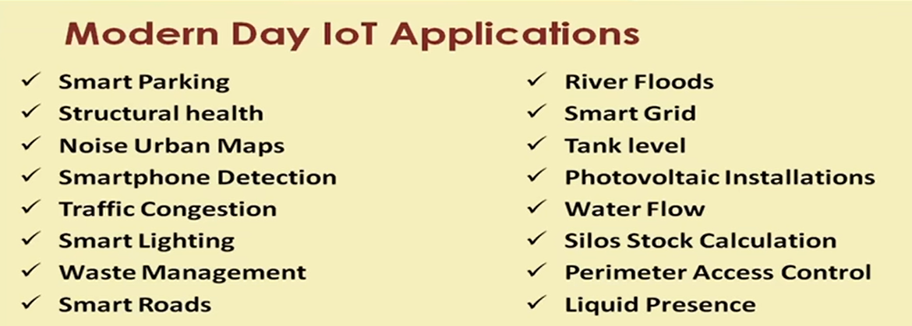
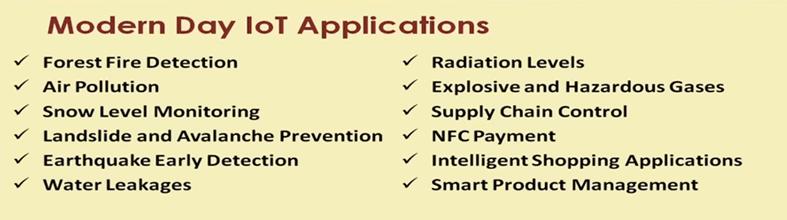
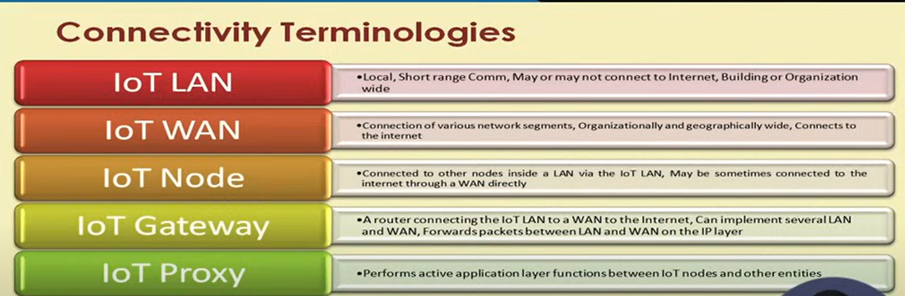
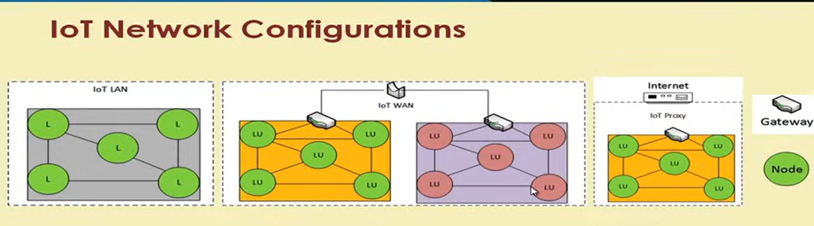
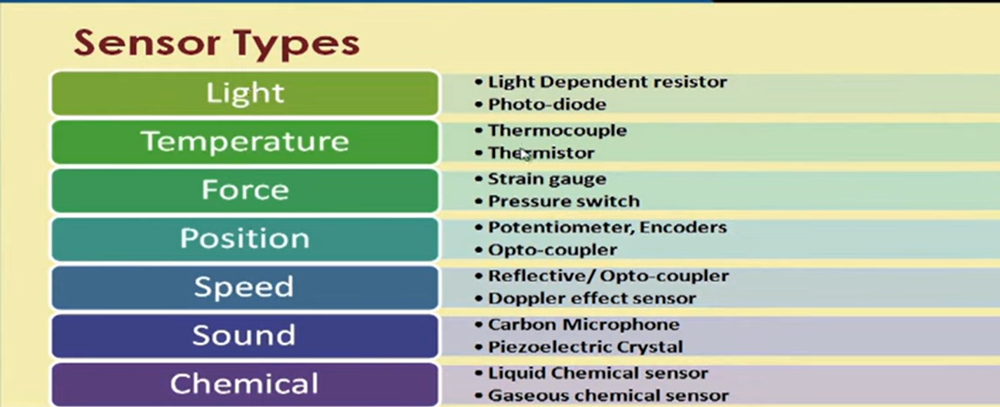

# LECTURE 1

>IoT is interconnection of different computers and computing devices

## Why IoT

* It is envisaged to provide advanced level of services usign IoT.
* All devices connected will have some computing platforms.
* Each of these devices will act as nodes.
* And a bigger internet can be formed.

>IoT is used to make smart homes and smart cities.

* Over 9 billion 'Things' are connected to the internet as of now
* Unification of technology such as low-power embedded systems, cloud computing and big-data, machine learning and networking.

## Origin of IoT

* The 2000s is the era of ubiquity, where users and the internet will be counted in billions.
* Humans may become the minority as generators and receivers of the traffic.
* Instead most of the trafficwill flow between devices and all kinds of things, Therefore creating a much wider and more complex Interent of Things

## Enablers of IoT
* RFID
* Nanotechnology
* Sensors
* Smart Networks

## Characteristics of IoT

* Efficient, scalable and associated architecture
* Unambiguous naming and addressing
* Abundance of sleeping nodes, mobile and non-IP devices
* Intermittent connectivity

### Market Share of IoT

* 40.2% Manufacturing/Business :- For Real-time analytics of supply chains and equipment, robotic machinery
* 30.3% Healthcare :- Portable health monitoring, electronic record keeping, pharmaceutical safegaurd
* 8.3% Retail :- Inventory tracking, smartphone purchasing, anonymous analytics of consumer choices
* 7.7% Security :- Biometric and facial recognition locks, remote sensors

### Evolution of Connected Devices

ATMs -> Web -> Meters -> Digital locks -> Hospitals -> Vehicles -> Cities -> Dust

### Applications of IoT

## Baseline Connectivity Technologies

>There are number of technologies that are closely related to IoT.

1. Machine-to-Machine communications (M2M)
2. Cyber-Physical-Systems (CPS)
3. Web-of-Things (WoT)

### IoT vs M2M

* M2M refers to interactions between machines and devices
* Interactions via cloud infra
* M2M offers means for managing devices and device interactions while also collecting machine or sensor data.
* M2M is a term introduced by telecom service providers.

>M2M is a part of IoT

* IoT has a broader scope than M2M, since it comprises of broader range of interactions between devices.
* It also enables the composition of workflows comprising of all of the above interactions. (devices, human and applications)
* IoT includes the notion of internet connectivity, but is not necessarily focused on the use of telecom networks.

### IoT vs WoT

* WoT enables access and control over IoT resources and applications using mainstream web technologies (HTML, JS, AJAX etc).
* Therefore, WoT is based in RESTFUL principles and REST APIs, Which enable both developer and deployers to benefit from the popularity and maturity of web trechnologies.

# LECTURE 2

## Connectivity Terminologies

  

### Examples

 

* The nodes represented by green circles have L: Local link adresses or LU: Link addresses which are unique locally.
* Nodes within a gateway's jurisdiction have addresses that are valid within the gateway's domain only
* Same addresses can be repeated in another domain
* The gateways have a unique network prefix which can be used to identify them globally

>All this is being done to save address space

### Gateway Allotment

* The network is connected to the internet has routers with their set of addresses and ranges
* These routers have multiple gateways connected to them which can forward packets from the nodes to the internet, only via these routers.
* The routers assign prefixes to the gateways under them, so that the gateways can be identified with them.
* If a node moves from one node to another, the prefix also changes, therefore allows mobility of nodes without any confusion.

### Mobility of nodes

* The gateways are attached to a remote anchor by protocols like Mobile IPv6, and are immune to changes of network prefixes.
* The address of the nodes within the gateways also remain unchanged
* The nodes can communicate directly to the internet through tunnels created by gateways and routers
* Nodes can communicate to a remote anchor point instead of channeling their packets through the router using tunneling protocol like IKEv2 (Internet Key Exchange version 2)

### Summary

* All nodes are present in boxes called gateways.
* Nodes in different gateways can have same local address
* Gateways are identifiable through unique prefixes
* Change of address of a gateway does not affect the local address of the nodes
* If a node moves from one gateway to another, then its address changes.

### Gateways

* IoT gateways with or without proxies are responsible for Interent connectivity snf IoT LAN intra-connectivity
* Prefixes are obtained using DHCPv6 and delegated to the nodes using SLAAC (stateless addressing)
* LU addresses are maintained independently of globally routable addresses, in cases where internal address stability is of prime concern
* LU cannot directly communicate with upper layers which is solved by implementing an application layer proxy

### Multi-homing

* A node or a network connected to multiple networks for improved reliability

# LECTURE 3

## Sensors

> A sensor detects (senses) changes in the ambient conditions or in the state of another device or system, and forwards or processes this information in a certain manner [1].
> A device which detects or measures a physical property and records, indicates, or otherwise responds to it [2].

* They perform physical changes in response to a stimuli
* Transducers convert one energy to another kind of energy (mic).
  
>Sensor vs Tansducers: Tranducers term is used for both sensors and actuators.

### Features of Sensors

* Sensitive to the measured property
* Insensitive to any other property likely encountered in its application.
* It does not influence the measured property
  
### Sensor Resolution

* Resolution of the sensor is the smallest change it can detect in the quantity that it is measuring.
* The more the resolution of the sensorm the more accurate is its precision.
* A sensor's accuracy does not depend on its resolution.
  
### Classification

* Based on Output
    * Analog: produce continuous output signal or voltage which is generally proportional to the quantity being measured
    * Digital: Produce discrete (or binary) digital output signals 

* Based on Type
    * Scalar: Measure only the magnitude (like pressure, strain, etc). Does not measure direction
    * vector/multimedia: Produce magnitude and direction of the measure.
  

 

### Sensorial Deviations

The full scale range of the senosr defines the maximum and minimum values of the measured property

* The sensitivity of a sensor under real conditons may differ from the value specified. This is called sensitivity error.
* If the output signals differ from the correct value by a constant, the sensor has an offset error or bias.

### Errors
* Non-linearity is deviation of a sensor's tranfer function from a straight line transfer function (TF)
* This is defined by the amount the output differs from the ideal TF over the full range of the sensor, which is denoted as percentage of the full range.
* If the output signal slowly changes independent of the measured property, is called drift
* Hysteresis error causes the sensor output value to vary depending on the sensor's previous values (heating and magnetic)
* Quantization error
* Aliasing error
* Noise