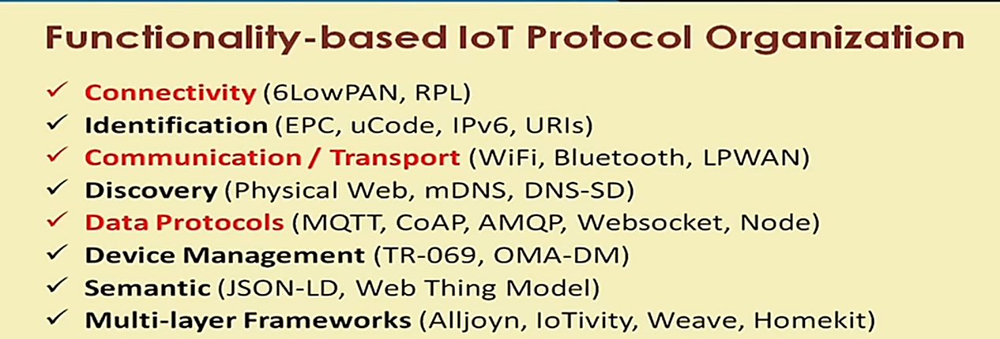
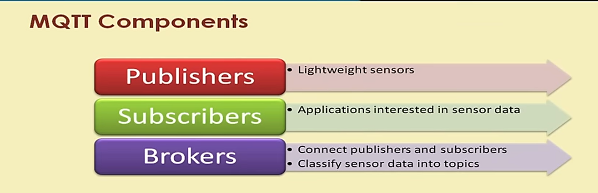
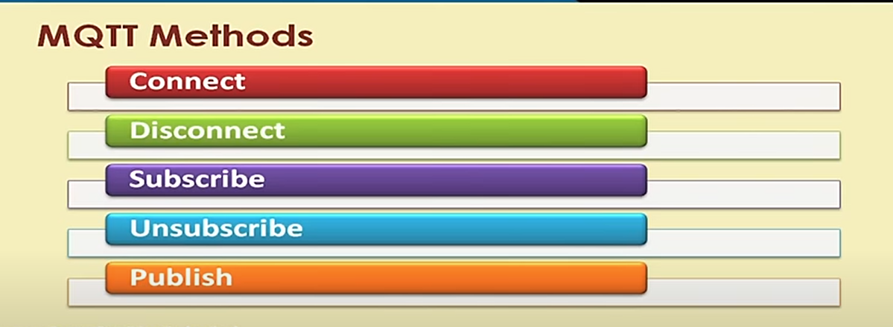
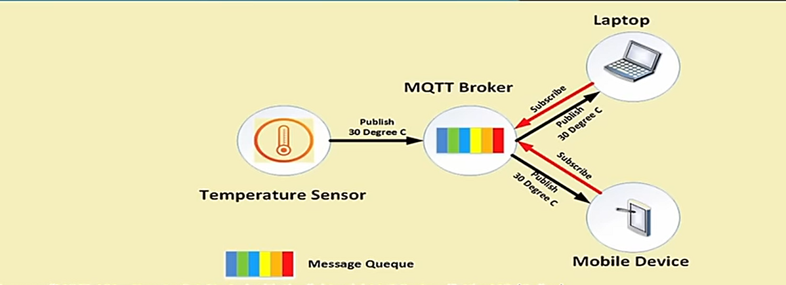

# LECTURE 1

## Basics of IoT Networking - 2

### Message Queue Telemetry Transport (MQTT)

* It is a publish-subscribe-based light weight messaging protocol for use in conjunction with the TCP/IP protocol
* Designed to provide connectivity (mostly embedded) between applications and middle wares on one side and networks and communications on the other side.
* A message broker controls the publish-subscribe messaging pattern
* A topic to which a client is subscribed is updated in the form of messages and distributed by the message broker
* MQTT is Designed for:
  * Remote connections
  * Limited Bandwidth
  * Small-code footprint
  

* Communication
  * The protocol uses publish/subscribe architecture rather than request/response
  * It is event-driven
  * The central communication point is the MQTT broker
  * Each client publishes a message to the broker that includes the topic. The topic is the routing information for the broker
  * Each client that wants to receive messages subscribe to a certain topic and the broker delivers all messages matching the topic
  * This architecture enables scalability without having dependencies between the data producers and consumers
  * The topic is a simple string that can have more heirarchical levels seperated by slash (Ex: house/living/temperature)
  * Wilcards can also be used in topics

* Applications that use MQTT
  * Facebook messanger
  * AWS
  * Azure
  * Adafruit

### SMQTT secured MQTT
* Uses encryption based on light weight attribute based encryption
* It uses broadcast encryption feature, in which 1 message is encrypted and delivered to multiple nodes
* The algorithms consists of 4 stages:
  * Setup : Subscribers and Publishers register to the broker and obtain the master secret key
  * Encryption : The master key is used to encrypt the data by the Publisher
  * Publish : The encrypted data is sent to the Subscibers
  * Decryption : the Subscribers use the master key to decrypt the message

# LECTURE 2
